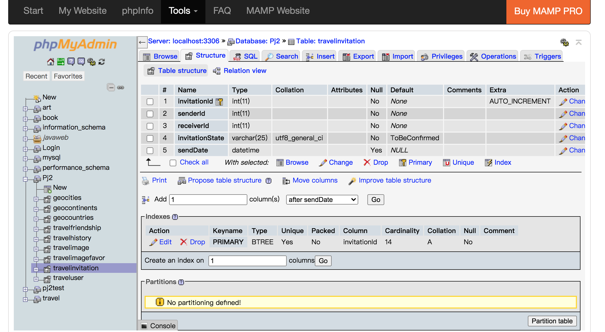
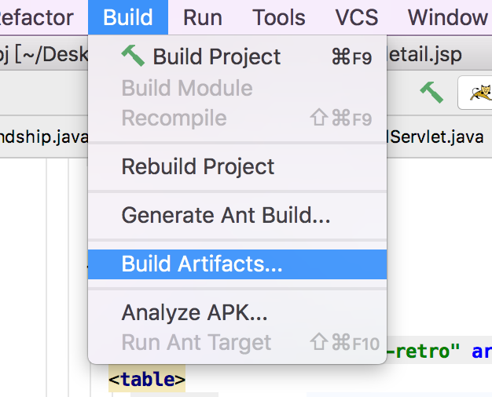

# Pj设计文档

## 1、 基本信息和整体项目结构

### 1.1 个人基本信息

姓名：赵一玲
学号：18300290055


### 1.2 项目上传信息

GitHub地址：https://github.com/mikollin/SOFT130071_pj

部署项目地址：http://mikollin.xyz:63888/pj_war_exploded/


### 1.3 整体项目结构

整体本pj采用了mvc模式，controller为servlet用于处理业务逻辑和实现功能等，view为jsp用于呈现数据，model是java bean（也许也包含相应的DAO）用于存储请求所需的结果。

项目结构图如下：


## 2、对数据库的修改和JavaBean介绍及Dao操作的实现

### 2.1 对数据库的修改

我沿用了之前Web课pj的数据库，同时在travelimage中还增加了username、UploadDate和favoredNum列。

由于我的足迹的实现，新增了表travelhistory。由于好友列表的实现，为了添加好友，新增了表travelfriendship和travelinvitation，为了bonus中对图片进行评论的实现，新增了表travelimagecomments和travelimagecommentsfavor，由于以上新增的表都会在后面详细说明并展示结构，这里就不多赘述。


### 2.2 JavaBean介绍

由于增加了上述的表以及原有的表，我建立了主要的JavaBean如下：


其余的收藏和国家城市等的查找，我认为都是属于Picture的一个属性的一部分，直接使用getValue即可，包括Comments的点赞也是同理，不认为应该建立一个Java Bean。


### 2.3 Dao操作的实现

首先先写一个基本操作的DAO，包含CRUD各种操作，使用了JdbcUtil和ReflectionUtil的相关操作。

主要包含以下几个方法：

```java
public <E> E getValue(String sql, Object ...args);
public List<T> getForList(String sql, Object ... args);
public T getInstance(String sql,Object ... args);
//通用的增删改的方法
public void update(String sql, Object... args);
```

然后由上述的java bean，建立相应的Dao的子类，方便之后反射将数据库中的记录封装成实体。


## 3、 基本功能的完成情况

### 3.1 非登录能访问的页面

#### 3.1.1 register&login

##### 3.1.1.1 register

首先对于全部内容非空、用户名重复、邮箱格式不正确、邮箱重复、密码与确认密码不一致才用了bootstrapValidator结合jquery来进行合法性验证。同时用户名保证在【4，15】长度区间内，密码长度在【6，12】区间内。

这里先给出bootstrapValidator的js代码：

```js


$(function () {
    $('form').bootstrapValidator({
        message: 'This value is not valid',
        //live: 'enabled', //验证时机，enabled是内容有变化就验证（默认）
        feedbackIcons: {
            valid: 'glyphicon glyphicon-ok',
            invalid: 'glyphicon glyphicon-remove',
            validating: 'glyphicon glyphicon-refresh'
        },
        fields: {
            id: {
                message: '用户名验证失败',
                verbose: false, //代表验证按顺序验证。验证成功才会下一个（验证成功才会发最后一个remote远程验证）
                validators: {
                    notEmpty: {
                        message: '用户名不能为空'
                    },
                    regexp: {
                        regexp: /^[a-zA-Z0-9_]+$/,
                        message: '用户名只能包含大写、小写英文字母、数字和下划线'
                    },
                    stringLength: {
                        min: 4,
                        max: 15,
                        message: '用户名长度请保证在4到15位之间'
                    },
                    remote: { //ajax验证。server result:{"valid",true or false} （返回前台类型）

                        url:"/pj_war_exploded/checkServlet?method=usernameRegistered",
                        message: '用户名已存在,请重新输入',
                        delay: 500, //ajax刷新的时间是0.5秒一次
                        type: 'POST',
                        //自定义提交数据，默认值提交当前input value
                         data: function(validator) {
                            return {
                                id: $("input[name=id]").val()
                            };
                        }

                    }
                }
            },
            email: {
                message: '邮箱验证失败',
                verbose: false, //代表验证按顺序验证。验证成功才会下一个（验证成功才会发最后一个remote远程验证）

                validators: {
                    notEmpty: {
                        message: '邮箱地址不能为空'
                    },
                    regexp: {
                        regexp: /^([a-zA-Z0-9]+[_|\_|\.]?)*[a-zA-Z0-9]+@([a-zA-Z0-9]+[_|\_|\.]?)*[a-zA-Z0-9]+\.[a-zA-Z]{2,3}$/,
                        message: '邮箱格式错误'
                    },
                    remote:{ //ajax验证。server result:{"valid",true or false} （返回前台类型）

                        url:"/pj_war_exploded/checkServlet?method=emailRegistered",
                        //url:'../php/register.php',
                        message: '邮箱已存在,请重新输入',
                        delay: 500, //ajax刷新的时间是0.5秒一次
                        type: 'POST',
                        //自定义提交数据，默认值提交当前input value
                        data: function(validator) {
                            return {
                                email: $("input[name=email]").val()
                            };
                        }

                    }
                }
            },
            password1: {
                message: '密码验证失败',
                validators: {
                    notEmpty: {
                        message: '密码不能为空'
                    },
                    regexp: {
                        regexp: /^(?!([a-zA-Z]+|\d+)$)[a-zA-Z\d]{1,}$/,
                        message: '密码只能包含大写、小写英文字母、数字，且请保证同时包含字母和数字，否则为弱密码'
                        // onSuccess:function(){
                        //     let message="<i class=\"fa fa-lightbulb-o\" aria-hidden=\"true\"></i> 强密码";
                        //     let passMess=document.getElementById("rightPass");
                        //     passMess.innerHTML=message;
                        // }
                    },
                    // regexp2: {
                    //     regexp: /^(?!([a-zA-Z]+|\d+)$)[a-zA-Z\d]{1,}$/,
                    //     message: '弱密码',
                    //     validationMessage:'强密码'
                    // },
                    stringLength: {
                        min: 6,
                        max: 12,
                        message: '请保证在6到12位之间'
                    },
                    identical: {
                        field: 'password2',
                        message: '用户新密码与确认密码不一致！请修改！'
                    }
                }
            },
            password2: {
                message: '密码验证失败',
                validators: {
                    notEmpty: {
                        message: '密码不能为空'
                    },
                    // regexp: {
                    //     regexp: /^(?!([a-zA-Z]+|\d+)$)[a-zA-Z\d]{1,}$/,
                    //     message: '密码只能包含大写、小写英文字母、数字和下划线，且请保证同时包含字母和数字，否则为弱密码'
                    // },
                    // stringLength: {
                    //     min: 6,
                    //     max: 12,
                    //     message: '弱密码！请保证在6到12位之间'
                    // },
                    identical: {
                        field: 'password1',
                        message: '密码不一致！'
                       }
                }
            }
        }
    });
```

同时这里为了验证用户名是否重复，用ajax实时传到checkServlet进行验证，checkServlet包含多个check方法（包含usernameRegistered和emailRegistered），所以通过在url后面加上method的名字进行相应方法的调用，checkServlet调用UserDAO来进行数据库的操作。

代码如下：

```java
@WebServlet(name = "controller.CheckServlet", value = "/checkServlet")
public class CheckServlet extends HttpServlet {


    public void doGet(HttpServletRequest request, HttpServletResponse response)
            throws ServletException, IOException {
        doPost(request,response);
        System.out.println("get");

    }
    public void doPost(HttpServletRequest request, HttpServletResponse response)
            throws ServletException, IOException {

        request.setCharacterEncoding("UTF-8");

        String method = request.getParameter("method");
        System.out.println("post "+method);

        switch (method) {
            case "usernameRegistered":
                try {
                    usernameRegistered(request, response);
                } catch (Exception e) {
                    e.printStackTrace();
                }finally {
                    break;
                }

            case "emailRegistered":
                try {
                    emailRegistered(request, response);
                } catch (Exception e) {
                    e.printStackTrace();
                }finally {
                    break;
                }

            case "usernameExisted" :
                try {
                    usernameExisted(request, response);
                } catch (Exception e) {
                    e.printStackTrace();
                }finally {
                    break;
                }
            case "passwordCheck" :
                try {
                    passwordCheck(request, response);
                } catch (Exception e) {
                    e.printStackTrace();
                }finally {
                    break;
                }

        }
    }


    public void usernameRegistered(HttpServletRequest request, HttpServletResponse response)
            throws ServletException, IOException{


        String username = request.getParameter("id");
        // String email = request.getParameter("email");
        //String password = request.getParameter("password1");
        response.setCharacterEncoding("UTF-8");
        response.setContentType("application/json");
        PrintWriter out = response.getWriter();
//
//        out.println("<html><body>");
//        out.print("<h2>register</h2>");

//        JdbcUtil util = new JdbcUtil();
//        Connection conn = util.getConnection();
//        String sql = "use Pj2";
//        PreparedStatement pst = null;
//        ResultSet rs = null;
//        //Map map = new HashMap<>();
//
//        try {
//            pst = conn.prepareStatement(sql);
//            rs = pst.executeQuery();
            String sql = "select uid id,username username,email email,pass password,DateJoined date from traveluser where username= ? ";

//            pst = conn.prepareStatement(sql);
//            pst.setString(1, username);
//            rs = pst.executeQuery();
        User user=null;
        UserDAO userDAO=new UserDAO();
        user=userDAO.getInstance(sql,username);

        // if(rs.next()) {
        if(user!=null){
            //if (rs.next()) {
                //map.put("valid", false);
                out.print("{\"valid\":false}");
                System.out.println("false");
            } else {
                //map.put("valid", true);
                //out.print(map);
                out.print("{\"valid\":true}");
                System.out.println("true");
            }
//        } catch (SQLException e) {
//            e.printStackTrace();
//        } finally {
//            util.close(rs, pst, conn);
//        }

    }

    public void emailRegistered(HttpServletRequest request, HttpServletResponse response)
            throws ServletException, IOException{


        //String username=request.getParameter("id");
         String email = request.getParameter("email");

        response.setCharacterEncoding("UTF-8");
        response.setContentType("application/json");
        PrintWriter out = response.getWriter();

        String sql = "select uid id,username username from traveluser where email= ? ";


        User user=null;
        UserDAO userDAO=new UserDAO();
        user=userDAO.getInstance(sql,email);


        if(user!=null){

            out.print("{\"valid\":false}");
            System.out.println("false");
        } else {

            out.print("{\"valid\":true}");
            System.out.println("true");
        }


    }
```

返回的json数据（需要符合bootstrapValidator的要求）。

同时还需要进行密码强弱性的检测。

这里现在register.jsp中写入一个small标签，然后通过js，看它的正则表达式是否符合强密码的规定(密码中同时包含字母和数字)，如果符合，则往里面写入强密码的提示，同时更改颜色为绿色，如果不符合，且输入了正确的密码（包含了大小写字母和数字）则写入弱密码的提示，同时更改颜色为红色，否则强弱密码提示不显示，这个js function绑定在password1的onChange事件中。写完密码输入回车或者点一下别的地方使其失去焦点就会显示对应的检测标示。

这边只截取相关代码：

```jsp
<div class="form-group">
            <label>Password</label>
            <input class="form-control" id="password1" name="password1" type="password" placeholder=" Create your password" required>


<%--            <%if(request.getParameter("password1").matches("^(?!([a-zA-Z]+|\\d+)$)[a-zA-Z\\d]{1,}$")){ %>--%>
            <small class="help-block" id="rightPass" data-tv-validator="regexp" data-bv-for="password1" style="color:green;display: inline-block"> </small>


          </div>
```

js代码：

```js
<script defer>
  let password=document.getElementById("password1");
  let passMess=document.getElementById("rightPass");
  password.onchange=function() {

    if (password.value.match("^(?!([a-zA-Z]+|\\d+)$)[a-zA-Z\\d]{6,12}$")) {
      let message = "<i class=\"fa fa-lightbulb-o\" aria-hidden=\"true\"></i> 强密码";
      passMess.style.color = "green";
      passMess.innerHTML = message;
    } else if (password.value.match("^[a-zA-Z\\d]{1,}$")) {
      passMess.style.color = "rgb(191,42,42)";
      let message = "<i class=\"fa fa-lightbulb-o\" aria-hidden=\"true\"></i> 弱密码";

      passMess.innerHTML = message;
    }else if(!password.value.match("[a-zA-Z\\d]{1,}$")) {
      passMess.innerHTML="";
    }
  }
</script>
```

具体显示：


之后提交注册表单到RegisterServlet，添加记录到数据库后，因为要求“自动登录”，所以需要写session，然后跳转到之前点击login的网址（因为register都是通过login进入的）。

于是具体实现，会在login第一次被点击的时候记录之前的网址，即通过request.getHeader("referer")来实现，并写到session中。

然后进行一系列的上述操作，最后在重定向到该网址之前，把对应的写的session remove掉。

具体代码如下：

首先是RegisterServlet的相关代码：

```js
@WebServlet(name = "controller.RegisterServlet", value = "/register")
public class RegisterServlet extends HttpServlet {
    public void doPost(HttpServletRequest request, HttpServletResponse response)
            throws ServletException, IOException {

        request.setCharacterEncoding("UTF-8");
        String username = request.getParameter("id");
        String email = request.getParameter("email");
        String password = request.getParameter("password1");
        response.setCharacterEncoding("UTF-8");
        response.setContentType("application/json");
        PrintWriter out=response.getWriter();
//
//        out.println("<html><body>");
//        out.print("<h2>register</h2>");

//        JdbcUtil util = new JdbcUtil();
//        Connection conn = util.getConnection();
//        String sql = "use Pj2";
//        PreparedStatement pst = null;
//        ResultSet rs = null;

//        try {
//                pst = conn.prepareStatement(sql);
//                rs = pst.executeQuery();
//
//                sql = "INSERT INTO `traveluser`(`username`, `email`,`pass`,`DateJoined`) VALUES (?,?,?,?)";
//
//                pst = conn.prepareStatement(sql);
//                pst.setString(1,username);
//                pst.setString(2,email);
//                pst.setString(3,password);
                Timestamp date=new Timestamp(new java.util.Date().getTime());
//                pst.setDate(4,date);
//                pst.executeUpdate();
//
//                User user=new User(username,email,password,date);
//
        User user=null;
        UserDAO userDAO=new UserDAO();

        //密码加密
        //DeEncodingUtil encodingUtil=new DeEncodingUtil();
        //password= CodingUtil.encodeStringToBase64String(password);
              try {
            password=CodingUtil.EncoderByMd5(password);
        } catch (NoSuchAlgorithmException e) {
            e.printStackTrace();
        }

        user=userDAO.addUser(username,email,password,date);
                System.out.println(date.toString());
                System.out.println(user);
                request.getSession().setAttribute("user",user);

            HttpSession session=request.getSession();
            String path=(String)session.getAttribute("referer");
            session.removeAttribute("referer");
            //out.print("<script>alert(\"登录成功\")</script>");
            response.sendRedirect(path);

//        } catch (SQLException e) {
//            e.printStackTrace();
//        } finally {
//            util.close(rs, pst, conn);
//        }
    }


    }
```

然后是login写入登录前网址的代码：

```jsp
<%

  if(request.getAttribute("message")==null) {
    request.getSession().setAttribute("referer", request.getHeader("referer"));
    System.out.println(request.getHeader("referer"));
  }
%>
```

因为登录，不论成功还是失败都会先回到登录页，所以访问login.jsp且没有设置相应消息的即为第一次调用login的网页。

以上是对于register的完成。


##### 3.1.1.2 login

这里的login，需要对用户名/邮箱和密码进行验证，首先两个输入框有任何一个为空都不能提交，提交表单到LoginServlet中,首先通过userDAO中的get方法（通过username和password）来找到对应的user，然后因为邮箱也可以登录，所以如果user为null时要再写sql语句再通过email和password查一次，之后进行判断，如果user还是null，说明用户名和密码错误，设置错误提示，请求转发到login.jsp，进行相应的提示，如果成功，设置成功消息，也转发到login.jsp，进行相应的提示和alert，最后进行重定向到登录前的网址。

提示仿写bootstrap的样式，再加以修改

具体代码如下：

login.jsp:


```jsp
<%@ page contentType="text/html;charset=UTF-8" language="java" pageEncoding="UTF-8"%>


<html>

<%
  request.setCharacterEncoding("UTF-8");
  response.setCharacterEncoding("UTF-8");
%>

<head>

  <meta charset="UTF-8" >

  <meta http-equiv="X-UA-Compatible" content="IE=edge">
  <!-- 以上代码IE=edge告诉IE使用最新的引擎渲染网页，chrome=1则可以激活Chrome Frame. -->
  <meta name="viewport" content="width=device-width, initial-scale=1">
  <!-- 让当前 viewport 的宽度等于设备的宽度 -->

  <title>my_pj_登录</title>
  <script src="source/jquery-1.10.2/jquery-1.10.2.js"></script>

  <script src="source/bootstrap/js/bootstrap.min.js"></script>
  <link href="source/bootstrap/css/bootstrap.min.css" rel="stylesheet" />

  <script src="source/bootstrapValidator/js/bootstrapValidator.min.js"></script>
  <link href="source/bootstrapValidator/css/bootstrapValidator.min.css" rel="stylesheet" />

  <link rel="stylesheet" href="source/font-awesome-4.7.0/css/font-awesome.min.css"/>
  <link rel="stylesheet" type="text/css" media="screen" href="source/css/style.css" />

</head>


<body>

<header>

  <div>

    <div id="title">Hello World</div>

    <div id="titlebottom">

      Welcome to the "Hello World" to share your great pictures with us!


    </div>

    <div id="login" >

      <div>LOG IN TO YOUR ACCOUNT</div>


      <div>
        <form action="/pj_war_exploded/login" method="POST" id="to_login" >

          <div class="form-group">
            <label>Username/Email</label>
            <input class="form-control" id="id" name="id" type="text" placeholder="Username/Email" value="<%= (request.getParameter("id")==null)?"": request.getParameter("id")%>" required>
            <!--                        <span class="deom">!!!</span> &lt;!&ndash;提示信息&ndash;&gt;-->
            <%if(request.getAttribute("message")!=null){ %>
            <%= "<small id=\"message\" style=\"font-size:18px;color:rgb(191,42,42)\"> <i class=\"fa fa-exclamation-circle\" aria-hidden=\"true\"></i> "+request.getAttribute("message")+"</small>" %>
            <% } %>

          </div>
          <div class="form-group">
            <label>Password</label>
            <input class="form-control"  id="password" name="password" type="password" placeholder=" Input your password" value="<%= (request.getParameter("password")==null)?"": request.getParameter("password")%>" required>
          </div>


          <%

            if(request.getAttribute("message")==null) {
              request.getSession().setAttribute("referer", request.getHeader("referer"));
              System.out.println(request.getHeader("referer"));
            }
          %>


          <br>

          <div class="form-group">
            <button type="submit" id="login_submit" name="login_submit" class="btn btn-primary">login</button>
            <!--因为插件用的是jquery的submit 方法，不能用name="submit" 属性-->
          </div>


        </form>
      </div>


      <br>

      <a id="special" href="register.jsp">IF YOU HAVEN'T REGISTERED, CLICK THIS</a>


    </div>


  </div>

</header>


<footer>

  <div>

    <div>

      <p>LEARN MORE</p>

      <p>How it works?</p>

      <p>Meeting tools</p>

      <p>Live streaming</p>

      <p>Contact Method</p>

    </div>

    <div>

      <p>ABOUT US</p>

      <P>About us</P>

      <p>Features</p>

      <p>Privacy police</p>

      <p>Terms & Conditions</p>

    </div>

    <div>

      <p>SUPPORT</p>

      <p>FAQ</p>

      <p>Contact us</p>

      <p>Live chat</p>

      <p>Phone call</p>

    </div>

    <div>

      <p>ENJOY YOUR LIFE</p>

      <p>Copyright &copy 2010-2021 Yiling Zhao. </p>
      <p>All rights reserved.</p>
      <p> 备案号：18300290055</p>

    </div>

    <div>
      <p>

        <!-- wechat -->
        

      </p>

    </div>


  </div>


</footer>


</body>


</html>
<%
  if(request.getAttribute("message")!=null&&request.getAttribute("message").equals("用户名和密码错误")){
%>
<script>
  let username=document.getElementById("id");
  username.style.borderColor="rgb(191,42,42)";
  username.style.borderWidth="5px";
</script>
<% } else if(request.getAttribute("message")!=null&&request.getAttribute("message").equals("登录成功")){ %>
<script>


//  let forms=document.getElementById("login_submit");
//  forms.onclick=function () {
    let small=document.getElementById("message");

    small.style.color="green";

    alert("登录成功!");

 //   }
<% String path=(String)session.getAttribute("referer");%>
  window.location.href="<%= path%>";
<%
//String path=(String)session.getAttribute("referer");
System.out.println((String)session.getAttribute("referer"));
session.removeAttribute("referer");
System.out.println("delete referer");
//response.sendRedirect(path); %>

</script>
<% } %>

<%--<script src="source/js/login.js" ></script>--%>
```

然后是LoginServlet的相关代码：

```java
package controller;

import dao.UserDAO;
import domain.User;
import service.CodingUtil;

import javax.servlet.ServletException;
import javax.servlet.annotation.WebServlet;
import javax.servlet.http.HttpServlet;
import javax.servlet.http.HttpServletRequest;
import javax.servlet.http.HttpServletResponse;
import javax.servlet.http.HttpSession;
import java.io.IOException;
import java.io.PrintWriter;

// value的值指定在浏览器中的访问路径
@WebServlet(name = "controller.LoginServlet", value = "/login")
public class LoginServlet extends HttpServlet {
    protected void doPost(HttpServletRequest request, HttpServletResponse response)
            throws ServletException, IOException {

        request.setCharacterEncoding("UTF-8");
        String username = request.getParameter("id");
        String password = request.getParameter("password");
        response.setCharacterEncoding("UTF-8");
        response.setContentType("text/html;charset=UTF-8");
        PrintWriter out=response.getWriter();


//        JdbcUtil util = new JdbcUtil();
//        Connection conn = util.getConnection();
//        String sql = "use Pj2";
//        PreparedStatement pst = null;
//        ResultSet rs = null;
//        try {
//            pst = conn.prepareStatement(sql);
//            rs = pst.executeQuery();
//
//            sql = "select * from traveluser where username=? and pass=?";
//
//            pst = conn.prepareStatement(sql);
//            pst.setString(1,username);
//            pst.setString(2,password);
//            rs = pst.executeQuery();
        User user=null;
        UserDAO userDAO=new UserDAO();

        //密码加密比对
        //CodingUtil encodingUtil=new CodingUtil();
        //password= CodingUtil.encodeStringToBase64String(password);
      try {
            password=CodingUtil.EncoderByMd5(password);
        } catch (NoSuchAlgorithmException e) {
            e.printStackTrace();
        }

        user=userDAO.get(username,password);

        String sql="select uid id,username username,email email,pass password,DateJoined date from traveluser where email=? and pass=?";
        if(user==null){
            System.out.println("yyyy");
            user=userDAO.getInstance(sql,username,password);
        }

        //System.out.println(user);
           // if(rs.next()) {
        if(user!=null){
                //User user=new User(rs.getString("username"),rs.getString("email"),rs.getString("pass"),rs.getDate("DateJoined"));
                request.getSession().setAttribute("user",user);
                HttpSession session=request.getSession();
//                String path=(String)session.getAttribute("referer");
//                session.removeAttribute("referer");
                //out.print("<script>alert(\"登录成功\")</script>");
                request.setAttribute("message","登录成功");
                request.getRequestDispatcher("login.jsp").forward(request,response);
//                response.sendRedirect(path);
                //之后要重定向到点击login的哪个页面

            }
            else{
                request.setAttribute("message","用户名和密码错误");
                request.getRequestDispatcher("login.jsp").forward(request,response);
            }
//        } catch (SQLException e) {
//            e.printStackTrace();
//        } finally {
//            util.close(rs, pst, conn);
//        }
    }


}
```

登录失败的演示：


登录成功的提示：


同时还要求密码不得明文传输存储，因此一开始采用了base64的加密方法，但是后面base64可逆且不是标准的密码加密方法只是一种编码的方法，于是需要不可逆的加密方法，即最后更改后采用了md5.

具体实现如下：先构建了加密解密工具类CodingUtil

```java
package service;


import sun.misc.BASE64Decoder;

import java.io.IOException;
import java.io.UnsupportedEncodingException;
import java.util.Base64;


import java.io.UnsupportedEncodingException;
import java.security.MessageDigest;
import java.security.NoSuchAlgorithmException;


public class CodingUtil {

    public CodingUtil(){

    }
    /*
    base64
     */

    public static String encodeByteToBase64String(byte[] textbytes){
        Base64.Encoder encoder = Base64.getEncoder();
        return encoder.encodeToString(textbytes);
    }
    public static String encodeStringToBase64String(String text){
        Base64.Encoder encoder = Base64.getEncoder();
        return encoder.encodeToString(text.getBytes());
    }

    public static String decodeBase64StringToString(String base64String) throws IOException {
        BASE64Decoder decoder = new BASE64Decoder();
        byte[]bytes = decoder.decodeBuffer(base64String);
        return new String(bytes);
    }

    /*
    md5
     */


        /**利用MD5进行加密*/
        public static String EncoderByMd5(String str) throws NoSuchAlgorithmException, UnsupportedEncodingException{
            //确定计算方法
            MessageDigest md5=MessageDigest.getInstance("MD5");

            //加密后的字符串
            String newstr=encodeByteToBase64String(md5.digest(str.getBytes("utf-8")));
            return newstr;
        }

        /**判断用户密码是否正确
         *newpasswd 用户输入的密码
         *oldpasswd 正确密码*/
        public static boolean checkpassword(String newpasswd,String oldpasswd) throws NoSuchAlgorithmException, UnsupportedEncodingException{
            if(EncoderByMd5(newpasswd).equals(oldpasswd))
                return true;
            else
                return false;
        }


}
```

然后在注册的RegisterServlet方法中在insert前先把密码加密通过这个方法：

```java
try {
    password=CodingUtil.EncoderByMd5(password);
} catch (NoSuchAlgorithmException e) {
    e.printStackTrace();
}
```

然后在登录的LoginServlet中先把得到的password加密，然后看数据库中能否找到username和加密后的password对相对应的记录。


#### 3.1.2 detail详情页

首先每张图片的连接都会发送到DetailServlet中，以detail?imageId=xx的形式，然后detail中通过imageid往数据库中进行查询，然后dao将其封装成一个picture对象，放入request中，请求转发到detail.jsp进行显示，这里需要注意的一点是 显示时要判断如果为null显示空的字符串比较友好。

即， 如： `City : <%= picture.getCity()==null?"":picture.getCity() %>`

然后为了显示的比较友好对于upDate上传的时间显示为yyyy-mm-dd hh:mm:ss 然后动态判断当前用户是否喜欢过这张图片来设置样式不同，如果通过picturedao在travelimagefavor中找到相关的记录，设置valid为true，且点击前往cancelFavor来取消收藏，否则为false，点击前往setFavor来收藏，同时如果未登录的话也为false，但点击会前往login提示登录。

具体实现代码如下：

Detail.jsp:

```jsp
<%@ page import="domain.User" %>
<%@ page import="domain.Picture" %>
<%@ page import="dao.JdbcUtil" %>
<%@ page import="dao.PictureDAO" %>
<%@ page import="java.io.PrintWriter" %>
<%@ page import="java.util.ArrayList" %>
<%@ page import="java.net.CookieHandler" %>
<%@ page import="java.util.List" %>
<%@ page import="java.net.URLEncoder" %>
<%@ page import="java.net.URLDecoder" %>
<%@ page contentType="text/html;charset=UTF-8" language="java" %>
<!DOCTYPE html>
<html>
<head>
  <meta charset="UTF-8">


  <meta http-equiv="X-UA-Compatible" content="IE=edge">

  <meta name="viewport" content="width=device-width, initial-scale=1">

  <link rel="stylesheet" href="source/font-awesome-4.7.0/css/font-awesome.min.css"/>
  <link rel="stylesheet" type="text/css" media="screen" href="source/css/detail.css" />
  <title>my_pj_图片详情</title>
</head>


<body>

<header>
  <div>

    <div id="title">Hello World</div>
<br>
    <div id="titlebottom">

      Welcome to the "Hello World" to share your great pictures with us!


    </div>

  </div>
</header>

<div class="top">
  <ul>
    <!--  <ul id="1">  -->

    <li><a id="now" href="index.jsp">Home</a></li>
    <%--    <li><a href="browse.jsp">Browse</a></li>--%>
    <li><a href="search.jsp">Search</a></li>
    <!-- </ul> -->


    <li id="my_account">

      <%
        if(request.getSession()!=null&&request.getSession().getAttribute("user")!=null){
      %>

      <a href="#"> <%= ((User)(request.getSession().getAttribute("user"))).getUsername() %> </a>
      <ul>
        <li id="upload"><a href="upload.jsp"><i class="fa fa-cloud-upload" aria-hidden="true"></i> Upload</a></li>
        <li id="pics"><a href="mypics.jsp"><i class="fa fa-camera-retro" aria-hidden="true"></i> My Pics</a></li>
        <li id="favor"><a href="myfavor"><i class="fa fa-gratipay" aria-hidden="true"></i> My Favorite</a></li>
        <li id="favor"><a href="myfriends.jsp"><i class="fa fa-handshake-o" aria-hidden="true"></i> My Friends</a></li>
        <li id="log"><a href="logout"><i class="fa fa-sign-in" aria-hidden="true"></i> Log out</a></li>  <%-- 先注销session然后跳到登录页面？？--%>
      </ul>

      <% }else{ %>
      <a href="login.jsp">Log in</a>

      <% } %>
    </li>


  </ul>


</div>

<br>
<section>

  <div class="detail">

<% Picture picture=(Picture)request.getAttribute("pic"); %>
    <div class="til">DETAILS</div>

    <div class="size"> <%= picture.getTitle()==null?"":picture.getTitle() %> </div>


    <div class="size2"><i class="fa fa-camera" aria-hidden="true"></i>  taken by : <%=picture.getAuthor()==null?"":picture.getAuthor() %></div>

    <br>
    <div id="content">

      <div>
        " />
      </div>


      <div id="column">
        <div class="con_word">


          <div class="size"><%= picture.getFavoredNum()%></div>

          <p>PEOPLE LIKE THIS <i id="likeit" class="fa fa-heart" aria-hidden="true"></i></p>

        </div>


        <div class="con_word">


          <p><i class="fa fa-camera-retro" aria-hidden="true"></i> IMAGE DETAILS</p>
          <table>
            <tr><td>Content : <%= picture.getContent()==null?"":picture.getContent() %></td></tr>

            <tr><td>Country : <%= picture.getCountry()==null?"":picture.getCountry() %></td></tr>
            <tr><td>City : <%= picture.getCity()==null?"":picture.getCity() %></td></tr>
            <tr><td>UploadDate : <%
              String date= picture.getUploadDate().toString();
              date=date.substring(0,date.length()-2);
              out.println("<br>"+date);
            %></td></tr>

          </table>
        </div>

        <div class="con_word">

          <%
            boolean valid=false;

            if(request.getSession().getAttribute("user")!=null) {
              User user = (User) request.getSession().getAttribute("user");
              int uid = user.getId();
              PictureDAO pictureDAO = new PictureDAO();
              String sql = "select favorid from travelimagefavor where uid=? and imageid=?";
              Integer favorId = 0; //主要因为getValue找不到记录则return null，因此int会出错，转为Integer
              favorId = pictureDAO.getValue(sql, uid, picture.getImageId());

              if (pictureDAO.getValue(sql, uid, picture.getImageId())==null) {
                valid = false;
              } else if (favorId.intValue()>0) {
                valid=true;
              }
            }else{
              valid=false;
            }
          %>
          <div class="size2">LIKE THIS <a id="like" href="<% if(valid) out.println("cancelFavor?imageId="+picture.getImageId());

          else if(request.getSession().getAttribute("user")!=null)
            out.println("setFavor?imageId="+picture.getImageId());
          else{ out.println("login.jsp");} %>"
                                          onclick="<% if(valid) out.println("alert('取消收藏')");
          else if(request.getSession().getAttribute("user")!=null)
            out.println("alert('收藏成功');");
          else{ out.println("alert('您还未登录，将跳转到登录界面，请登录后操作...')");} %>">
            <i <% if(valid) out.println("style=\"color:red\""); %> class="fa fa-heart" aria-hidden="true"></i></a></div>


        </div>

      </div>


    </div>

    <div id="description">
      <h3>DESCRIPTION : </h3>
      <p><%= picture.getDescription()==null?"":picture.getDescription() %></p>
    </div>

  </div>

    <%--
    设置足迹
    --%>
    <%
      //把picture的信息以Cookie的方式传递，若要删除一个Cookie
      //则先确定要被删除的Cookie
      //前提MY_FOOTPRINTS_开头的Cookie数量大于等于10

      User user=((User)(request.getSession().getAttribute("user")));

      if(user!=null) {
        Cookie[] cookies = request.getCookies();
        //保存所有MY_FOOTPRINTS_username开头的Cookie
        List<Cookie> pictureCookies = new ArrayList<Cookie>();
        //用来保存和myfavor.jsp传入的picture匹配的哪个Cookie
        Cookie tempCookie = null;
        if (cookies != null && cookies.length > 0) {

          for (Cookie c : cookies) {
            String cookieName = c.getName();
            if (cookieName.startsWith("MY_FOOTPRINTS_" + user.getUsername())) {
              pictureCookies.add(c);
//            System.out.println("dododo");
//              System.out.println(c.getValue() + "  and   " + picture.getImageId());
//              System.out.println(c.getValue().equals(picture.getImageId().toString()));

              //if(URLDecoder.decode(c.getValue(),"UTF-8").equals(picture.getTitle())){ //picture's title 对比
              if (c.getValue().equals(picture.getImageId().toString())) {  //picture's imageId 对比
                tempCookie = c;  //是点了最近十个足迹中的图片，图片之间转换顺序，锁定对应点的那张图片，加到最后
               // System.out.println("dododo");
              }
            }
          }
        }

        if (pictureCookies.size() >= 10 && tempCookie == null) {
          tempCookie = pictureCookies.get(0); //点了最近十个足迹以外的图片，把第一个删掉
        }

        if (tempCookie != null) {
          tempCookie.setMaxAge(0);
          //System.out.println(tempCookie.getName());
          response.addCookie(tempCookie);//是点了最近十个足迹中的图片，图片之间转换顺序，删掉对应点的那张图片
        }

        // Cookie cookie=new Cookie("MY_FOOTPRINTS_"+user.getUsername()+picture.getImageId().toString(), URLEncoder.encode(picture.getTitle(), "UTF-8")); //图片标题不可重复

        Cookie cookie = new Cookie("MY_FOOTPRINTS_" + user.getUsername()+"_"+picture.getImageId(), picture.getImageId().toString()); //图片标题不可重复
        //System.out.println(picture.getImageId().toString());
        response.addCookie(cookie);


        //查找数据库中title是否重复的信息
        //select * from travelimage where title in (select Title from travelimage group by title having count(title) > 1

      }
    %>


</section>


<footer>

  <div>

    <div>

      <p>LEARN MORE</p>

      <p>How it works?</p>

      <p>Meeting tools</p>

      <p>Live streaming</p>

      <p>Contact Method</p>

    </div>

    <div>

      <p>ABOUT US</p>

      <P>About us</P>

      <p>Features</p>

      <p>Privacy police</p>

      <p>Terms & Conditions</p>

    </div>

    <div>

      <p>SUPPORT</p>

      <p>FAQ</p>

      <p>Contact us</p>

      <p>Live chat</p>

      <p>Phone call</p>

    </div>

    <div>

      <p>ENJOY YOUR LIFE</p>

      <p>Copyright &copy 2010-2021 Yiling Zhao. </p>
      <p>All rights reserved.</p>
      <p> 备案号：18300290055</p>

    </div>

    <div>
      <p>

        <!-- wechat -->
        

      </p>

    </div>


  </div>


</footer>


</body>


</html>
<script src="source/js/setFavor.js"></script>
<script defer>
  //alert(document.getElementById('con_pic').width+380);
  //alert(document.getElementById('content').style.getPropertyValue('min-width'));

  if(document.getElementById('con_pic').width+380>1200){
    document.getElementById('content').style.setProperty('width',document.getElementById('con_pic').width+380+250+'px');
    document.getElementById('detail').style.setProperty('width',document.getElementById('con_pic').width+380+250+'px');
    document.getElementsByTagName('header')[0].style.setProperty('width',document.getElementById('con_pic').width+380+290+'px');
    document.getElementsByClassName('top')[0].style.setProperty('width',document.getElementById('con_pic').width+380+290+'px');
    document.getElementsByTagName('footer')[0].style.setProperty('width',document.getElementById('con_pic').width+380+290+'px');


  }


</script>
```

同时在detail.jsp还需要设置myfavor页面中的我的足迹，以上是初步的cookie版本的实现，但是询问助教后发现需要保存之前所有登录次数的历史，打算新建数据库然后来进一步更改。

放上DetailServlet的代码：

```java
package controller;

import dao.PictureDAO;
import dao.UserDAO;
import domain.Picture;
import domain.User;

import javax.servlet.RequestDispatcher;
import javax.servlet.ServletException;
import javax.servlet.annotation.WebServlet;
import javax.servlet.http.HttpServlet;
import javax.servlet.http.HttpServletRequest;
import javax.servlet.http.HttpServletResponse;
import javax.servlet.http.HttpSession;
import java.io.IOException;
import java.io.PrintWriter;
import java.sql.Timestamp;
import java.util.ArrayList;
import java.util.List;

// value的值指定在浏览器中的访问路径
@WebServlet(name = "controller.DetailServlet", value = "/detail")
public class DetailServlet extends HttpServlet {
    public void doGet(HttpServletRequest request, HttpServletResponse response)
            throws ServletException, IOException {

        request.setCharacterEncoding("UTF-8");
        response.setCharacterEncoding("UTF-8");
        String imageId=request.getParameter("imageId");


        String sql = "SELECT imageId,path,title,description,favoredNum,content,uid authorId,cityCode,countrycodeiso countryCode from travelimage where imageid=?";

        PictureDAO daoPicture=new PictureDAO();
        Picture picture=daoPicture.getInstance(sql,imageId);
        int uid=picture.getAuthorId();
        sql="select username from traveluser where uid=?";
        UserDAO userDAO=new UserDAO();

        picture.setAuthor(userDAO.getValue(sql,uid));
        sql="select countryname from geocountries where iso=?";
        String countryname=daoPicture.getValue(sql,picture.getCountryCode());
        picture.setCountry(countryname);

        sql="select asciiname from geocities where geonameid=?";
        String city=daoPicture.getValue(sql,picture.getCityCode());
        picture.setCity(city);

        sql="select uploaddate from travelimage where imageid=?";
        Timestamp uploadDate=daoPicture.getValue(sql,imageId);
        picture.setUploadDate(uploadDate);

        request.setAttribute("pic",picture);

        RequestDispatcher dispatcher=request.getRequestDispatcher("detail.jsp");
        dispatcher.forward(request,response);


    }


    }
```


同时这里还多写了一段js代码保证上传的图片很宽时导航栏和header都会随之变化。

```js
if(document.getElementById('con_pic').width+380>1200){
  document.getElementById('content').style.setProperty('width',document.getElementById('con_pic').width+380+250+'px');
 document.getElementsByClassName('detail')[0].style.setProperty('width',document.getElementById('con_pic').width+380+250+'px');
    document.getElementsByClassName('detail')[1].style.setProperty('width',document.getElementById('con_pic').width+380+250+'px');

  document.getElementsByTagName('header')[0].style.setProperty('width',document.getElementById('con_pic').width+380+290+'px');
  document.getElementsByClassName('top')[0].style.setProperty('width',document.getElementById('con_pic').width+380+290+'px');
  document.getElementsByTagName('footer')[0].style.setProperty('width',document.getElementById('con_pic').width+380+290+'px');


}
```


实现情况：

未登录时查看：


未收藏：


已收藏：


然后附上对应的CancelFavorServlet和SetFavorServlet的代码：

CancelFavorServlet：

需要往travelimagefavor中删除对应的字段然后将travelimage中的favoredNum字段减1，再重定向回detail/myfavor页面

```java
package controller;

import dao.PictureDAO;
import dao.UserDAO;
import domain.Picture;
import domain.User;

import javax.servlet.RequestDispatcher;
import javax.servlet.ServletException;
import javax.servlet.annotation.WebServlet;
import javax.servlet.http.HttpServlet;
import javax.servlet.http.HttpServletRequest;
import javax.servlet.http.HttpServletResponse;
import java.io.IOException;

// value的值指定在浏览器中的访问路径
@WebServlet(name = "controller.CancelFavorServlet", value = "/cancelFavor")
public class CancelFavorServlet extends HttpServlet {
    public void doGet(HttpServletRequest request, HttpServletResponse response)
            throws ServletException, IOException {

        request.setCharacterEncoding("UTF-8");
        response.setCharacterEncoding("UTF-8");
        String imageId=request.getParameter("imageId");

        User user=(User)request.getSession().getAttribute("user");

        int uid=user.getId();
        String sql="DELETE FROM `travelimagefavor` WHERE uid=? and imageid=?";
        PictureDAO pictureDAO=new PictureDAO();
        pictureDAO.update(sql,uid,imageId);
        Integer favoredNum=0;
        sql="select favoredNum from travelimage where imageid=?";
        favoredNum=pictureDAO.getValue(sql,imageId);
        favoredNum=favoredNum-1;
        sql="UPDATE `travelimage` SET `favorednum`=? WHERE imageid=?";
        pictureDAO.update(sql,favoredNum,imageId);

        if(request.getParameter("referer")==null) {
            response.sendRedirect("detail?imageId=" + imageId);
        }
        else if(request.getParameter("referer").equals("myfavor")){

            response.sendRedirect("myfavor");
        }


    }


    }
```


SetFavorServlet：

需要往travelimagefavor中插入新字段然后将travelimage中的favoredNum字段加1，再重定向回detail页面

```java
package controller;

import dao.PictureDAO;
import dao.UserDAO;
import domain.Picture;
import domain.User;

import javax.servlet.RequestDispatcher;
import javax.servlet.ServletException;
import javax.servlet.annotation.WebServlet;
import javax.servlet.http.HttpServlet;
import javax.servlet.http.HttpServletRequest;
import javax.servlet.http.HttpServletResponse;
import java.io.IOException;

// value的值指定在浏览器中的访问路径
@WebServlet(name = "controller.SetFavorServlet", value = "/setFavor")
public class SetFavorServlet extends HttpServlet {
    public void doGet(HttpServletRequest request, HttpServletResponse response)
            throws ServletException, IOException {

        request.setCharacterEncoding("UTF-8");
        response.setCharacterEncoding("UTF-8");

        User user=(User)request.getSession().getAttribute("user");
        String imageId=request.getParameter("imageId");
        int uid=user.getId();
        String sql="INSERT INTO `travelimagefavor`(`UID`, `ImageID`) VALUES (?,?)";
        PictureDAO pictureDAO=new PictureDAO();
        pictureDAO.update(sql,uid,imageId);
        Integer favoredNum=0;
        sql="select favoredNum from travelimage where imageid=?";
        favoredNum=pictureDAO.getValue(sql,imageId);
        favoredNum=favoredNum+1;
        sql="UPDATE `travelimage` SET `favorednum`=? WHERE imageid=?";
        pictureDAO.update(sql,favoredNum,imageId);

        response.sendRedirect("detail?imageId="+imageId);


//
//        RequestDispatcher dispatcher=request.getRequestDispatcher("detail.jsp");
//        dispatcher.forward(request,response);


    }


    }
```

以上为详情页的实现。


#### 3.1.3 index首页

导航栏的部分基本同之前的Web项目，然后加了一个logo图片，这里就不多做赘述了，遇到的一些显示方面的问题在下面会详细阐述的。而logo图片需要设置padding调整一下大小，保证能够完整显示。选用这个三条鱼的logo，首先我们的网站名是hello world，有种新生看世界之感，然后万物起源均来自海洋，这也是我们网站最开始会采用海洋图为背景的原因，三条鱼意味着通过这个旅游图片分享平台来翱游世界。

首页首先利用bootstrap框架来做轮播图，然后这边访问index.jsp时首先会请求转发到HomeServlet中，然后在这了servlet里访问数据库中最热门（即收藏数量最多的）三张图片和标题，形成一个名为hotpics的`List<Picture>`，以便之后放到轮播图中，同时还会访问数据库中updateTime倒序排列的前8张图片放到下方最新的图片中，每个最新的图片都包含标题、作者、主题和发布时间。

index.jsp的代码如下：

需要先进行判断request中是否能get到“hotpics”和“newestpics”这两个参数，如果不能get到说明在访问此页面之前没有去过HomeServlet页面，所以会先请求转发到HomeServlet，之后等这两个参数都能get到了再进行相应的显示。

```jsp
<%@ page import="domain.User" %>
<%@ page import="domain.Picture" %>
<%@ page import="java.util.List" %>
<%@ page import="dao.UserDAO" %><%--
  Created by IntelliJ IDEA.
  User: yilingzhao
  Date: 2020/7/11
  Time: 下午1:58
  To change this template use File | Settings | File Templates.
--%>
<%@ page contentType="text/html;charset=UTF-8" language="java" %>
<!DOCTYPE html>
<html>
<head>
  <meta charset="UTF-8">


  <meta http-equiv="X-UA-Compatible" content="IE=edge">

  <meta name="viewport" content="width=device-width, initial-scale=1">
  <link href="source/bootstrap-3.3.7-dist/css/bootstrap.css" rel="stylesheet">

  <script src="https://apps.bdimg.com/libs/jquery/2.1.4/jquery.min.js"></script>
  <script src="source/bootstrap-3.3.7-dist/js/bootstrap.min.js"></script>

  <link rel="stylesheet" type="text/css" media="screen" href="source/css/home.css" />
  <link rel="stylesheet" href="source/font-awesome-4.7.0/css/font-awesome.min.css"/>
  <title>my_pj_首页</title>
</head>
<body>

<header>
  <div>

    <div id="title">Hello World</div>

    <div id="titlebottom">

      Welcome to the "Hello World" to share your great pictures with us!


    </div>

  </div>
</header>

<div class="top">
  <ul>
    <!--  <ul id="1">  -->
    <li></li>

    <li><a id="now" href="index.jsp">Home</a></li>
<%--    <li><a href="browse.jsp">Browse</a></li>--%>
    <li><a href="search.jsp">Search</a></li>
    <!-- </ul> -->


    <li id="my_account">

      <%
        if(request.getSession()!=null&&request.getSession().getAttribute("user")!=null){
      %>

      <a href="#"> <%= ((User)(request.getSession().getAttribute("user"))).getUsername() %> </a>
      <ul >

        <li id="upload"><a href="upload.jsp"><i class="fa fa-cloud-upload" aria-hidden="true"></i> Upload</a></li>
        <li id="pics"><a href="mypics.jsp"><i class="fa fa-camera-retro" aria-hidden="true"></i> My Pics</a></li>
        <li id="favor"><a href="myfavor"><i class="fa fa-gratipay" aria-hidden="true"></i> My Favorite</a></li>
        <li id="friend"><a href="myfriends.jsp"><i class="fa fa-handshake-o" aria-hidden="true"></i> My Friends</a></li>
        <li id="log"><a href="logout"><i class="fa fa-sign-in" aria-hidden="true"></i> Log out</a></li>  <%-- 先注销session然后跳到登录页面？？--%>
      </ul>

      <% }else{ %>
      <a href="login.jsp">Log in</a>

      <% } %>
    </li>


  </ul>


</div>


<section >

  <a href="#" onclick="gototop()">
    
  </a>


  <script>
    function gototop(){
      window.scrollTo('0','0');  //回到顶部
    }
  </script>


  <div  id="carousel-example-generic" class="carousel slide" data-ride="carousel">
    <!-- Indicators -->
    <ol class="carousel-indicators">
      <li data-target="#carousel-example-generic" data-slide-to="0" class="active"></li>
      <li data-target="#carousel-example-generic" data-slide-to="1"></li>
      <li data-target="#carousel-example-generic" data-slide-to="2"></li>
    </ol>

    <%
      List<Picture> hotpics=(List<Picture>)request.getAttribute("hotpics");
      List<Picture> newestpics=(List<Picture>)request.getAttribute("newestpics");
      if(hotpics==null&& newestpics==null) {
        request.getRequestDispatcher("index").forward(request, response);
      }else{


    %>


    <!-- Wrapper for slides -->
    <div class="carousel-inner" role="listbox">

      <%
        for(int i=0;i<hotpics.size();i++){
          if(i==0){
      %>

      <div class="item active">
        <%} else{%>
        <div class="item">
        <% } %>
        " alt="...">
        <div class="carousel-caption">
          <%= hotpics.get(i).getTitle()==null?"":hotpics.get(i).getTitle()%>
        </div>
      </div>


      <%
          }
      %>
<%--        <div class="item active" style="background:url(source/upfile/2-6596048341.jpg); background-size:cover;">--%>
<%--        --%>
<%--        <div class="carousel-caption">--%>
<%--         test--%>
<%--        </div>--%>
<%--      </div>--%>
<%--      <div class="item" style="background:url(source/upfile/2-6596048341.jpg); background-size:cover;">--%>
<%--        --%>
<%--        <div class="carousel-caption">--%>
<%--          test--%>
<%--        </div>--%>
<%--      </div>--%>
<%--        <div class="item" style="background:url(source/img/头图.jpg); background-size:cover;">--%>
<%--          --%>
<%--          <div class="carousel-caption">--%>
<%--            test--%>
<%--          </div>--%>
<%--       </div>--%>
    </div>


    <!-- Controls -->
    <a class="left carousel-control" href="#carousel-example-generic" role="button" data-slide="prev">
      <span class="glyphicon glyphicon-chevron-left" aria-hidden="true"></span>
      <span class="sr-only">Previous</span>
    </a>
    <a class="right carousel-control" href="#carousel-example-generic" role="button" data-slide="next">
      <span class="glyphicon glyphicon-chevron-right" aria-hidden="true"></span>
      <span class="sr-only">Next</span>
    </a>
  </div>
  </div>

  <%
  for(Picture picture:newestpics){
%>
  <div class="pic">
    <a href="detail?imageId=<%=picture.getImageId() %>">
       ">
      </a>
    <p class="word1" style="font-size: 16px;padding-top: 10px">
      <%= picture.getTitle()%>
    </p>
    <p class="word1">
     Author :
      <%
        int uid=picture.getAuthorId();
        String sql="select username from traveluser where uid=?";
        UserDAO userDAO=new UserDAO();
        String username=userDAO.getValue(sql,uid);
        out.println(username+"<br>");
      %>
      Content : <%= picture.getContent()+"<br>"%>
      UploadDate: <% String date= picture.getUploadDate().toString();date=date.substring(0,date.length()-2); out.print(date+"<br>"); %>
    </p>
  </div>


  <% }} %>


</section>

</body>


<footer>

  <div>

    <div>

      <p>LEARN MORE</p>

      <p>How it works?</p>

      <p>Meeting tools</p>

      <p>Live streaming</p>

      <p>Contact Method</p>

    </div>

    <div>

      <p>ABOUT US</p>

      <P>About us</P>

      <p>Features</p>

      <p>Privacy police</p>

      <p>Terms & Conditions</p>

    </div>

    <div>

      <p>SUPPORT</p>

      <p>FAQ</p>

      <p>Contact us</p>

      <p>Live chat</p>

      <p>Phone call</p>

    </div>

    <div>

      <p>ENJOY YOUR LIFE</p>

      <p>Copyright &copy 2010-2021 Yiling Zhao. </p>
      <p>All rights reserved.</p>
      <p> 备案号：18300290055</p>

    </div>

    <div>
      <p>

        <!-- wechat -->
        

      </p>

    </div>


  </div>


</footer>


</body>


</html>
```


对应的HomeServlet的代码如下（之前已经详细解释过了）：

```java
package controller;

import dao.PictureDAO;
import domain.Picture;

import javax.servlet.ServletException;
import javax.servlet.annotation.WebServlet;
import javax.servlet.http.HttpServlet;
import javax.servlet.http.HttpServletRequest;
import javax.servlet.http.HttpServletResponse;
import javax.servlet.http.HttpSession;
import java.io.IOException;
import java.util.ArrayList;
import java.util.List;

@WebServlet(name = "controller.HomeServlet", value = "/index")
public class HomeServlet extends HttpServlet {


    public void doGet(HttpServletRequest request, HttpServletResponse response)
            throws ServletException, IOException {
        request.setCharacterEncoding("UTF-8");
        response.setCharacterEncoding("UTF-8");

        PictureDAO pictureDAO=new PictureDAO();
        String sql="select title,path from travelimage order by favorednum desc limit 0,3";
        List<Picture> pictureList=new ArrayList<Picture>();
        pictureList=pictureDAO.getForList(sql);
        request.setAttribute("hotpics",pictureList);

        sql="select title,imageId,path,uid authorId,content,uploadDate from travelimage order by uploaddate desc limit 0,8";
        pictureList= pictureList=pictureDAO.getForList(sql);


        request.setAttribute("newestpics",pictureList);

        request.getRequestDispatcher("index.jsp").forward(request,response);


    }


}
```

在做这个页面的时候遇到了css相关的很多问题。

首先是轮播图的范围会覆盖导航栏，导致导航栏无法点击，于是为了解决这一问题通过设置轮播图最外层的div的margin-top，空出导航栏的高度，可以顺利的解决，之后进一步发现，其实是图片大小问题引发的副作用，如果图片太小，两边的切换按钮就会到上方去覆盖住所有按键。

然后是轮播图里的图片大小不一致，容易产生错位，同时会导致切换前/后一张图的按钮覆盖了导航栏的下拉菜单，解决这个问题需要采用这样的css设置：

将对应的轮播图里的图片设置为块元素，然后放大，设置相同的高度，使得看上去布局一致，这个问题导致的原因：当图片的大小出现在原生的bootstrap类属性限定中，图片会按照自己的大小进行布局。

```css
.carousel-inner > .item > img {

    display: block;
    width:100%;
    height:820px;

}
```

设置之后问题就搞定了。

最后还有一个最棘手的问题，就是我的下拉菜单设置了float：right，从而导致下拉菜单会被轮播图覆盖，之后想到把轮播图整体的层次关系改小，即`z-index:-1`这样设置，这样下拉菜单的确能够正确显示，但是我发现bootstrap的轮播图如果z-index小了切换图片键就会失效，于是只能删除float，该用定位，将其的z-index设大，就最终成功了。

然后为了浏览方便还加了一个回到顶部的按键。（这也在之前的web pj中做过，觉得这个功能还挺有必要的就保留下来了）。

整体实现效果如下：


#### 3.1.4 search搜索页

首先有两组单选框和一个输入框，两组都必须选择，然后点击search按钮会提交到SearchServlet，通过doGet方法获取用户输入的筛选方式和排序类型，来形成不同的sql语句，最后往数据库中进行搜索，先会将所有符合筛选的搜索一遍，获取记录，设为request的“allCount”属性，以便于之后计算页数，之后会根据分页的offset添加limit offset,5，将获得picture对象的集合放到request中，最后转发到search.jsp进行显示。这时需要一段js代码来回显之前用户输入的数据。

同时在结果框中，如果一开始刚登录的状态会显示提示输入以开始搜索，如果查不到任何结果会显示No results，如果有结果的话结果会分页显示。

这里是search.jsp的代码：

```jsp
<%@ page import="domain.User" %>
<%@ page import="java.util.ArrayList" %>
<%@ page import="domain.Picture" %>
<%@ page import="java.util.List" %><%--
  Created by IntelliJ IDEA.
  User: yilingzhao
  Date: 2020/7/11
  Time: 下午1:58
  To change this template use File | Settings | File Templates.
--%>
<%@ page contentType="text/html;charset=UTF-8" language="java" %>


<!DOCTYPE html>
<html>
<head>
  <meta charset="UTF-8">


  <meta http-equiv="X-UA-Compatible" content="IE=edge">

  <meta name="viewport" content="width=device-width, initial-scale=1">

  <link rel="stylesheet" href="source/font-awesome-4.7.0/css/font-awesome.min.css"/>
  <link rel="stylesheet" type="text/css" media="screen" href="source/css/search.css" />
  <title>my_pj_搜索页</title>
</head>


<body>

<header>
  <div>

    <div id="title">Hello World</div>

    <div id="titlebottom">

      Welcome to the "Hello World" to share your great pictures with us!


    </div>

  </div>
</header>

<div class="top">
  <ul>
    <!--  <ul id="1">  -->
    <li></li>
    <li><a href="index.jsp">Home</a></li>
    <%--    <li><a href="browse.jsp">Browse</a></li>--%>
    <li><a id="now" href="search.jsp">Search</a></li>
    <!-- </ul> -->


    <li id="my_account">

      <%
        if(request.getSession()!=null&&request.getSession().getAttribute("user")!=null){
      %>

      <a href="#"> <%= ((User)(request.getSession().getAttribute("user"))).getUsername() %> </a>
      <ul>
        <li id="upload"><a href="upload.jsp"><i class="fa fa-cloud-upload" aria-hidden="true"></i> Upload</a></li>
        <li id="pics"><a href="mypics.jsp"><i class="fa fa-camera-retro" aria-hidden="true"></i> My Pics</a></li>
        <li id="favor"><a href="myfavor"><i class="fa fa-gratipay" aria-hidden="true"></i> My Favorite</a></li>
        <li id="friend"><a href="myfriends.jsp"><i class="fa fa-handshake-o" aria-hidden="true"></i> My Friends</a></li>
        <li id="log"><a href="logout"><i class="fa fa-sign-in" aria-hidden="true"></i> Log out</a></li>
        <%-- 先注销session然后跳到登录页面？？--%>
      </ul>

      <% }else{ %>
      <a href="login.jsp">Log in</a>

      <% } %>
    </li>


  </ul>


</div>


<section>

  <div id="filter">
    <div class="til">SEARCH</div>
    <div id="choice">
      <form action="search" method="GET" name="to_search">
        <div style="font-family: Hoefler Text;font-size: 30px">Choose search type</div>
        <input name="type" value="Title" type="radio" required/>Filter by Title
        <input style="margin-left: 30px" name="type" value="Content" type="radio" />Filter by Theme

        <div style="font-family: Hoefler Text;font-size: 30px">Choose sort type</div>
        <input name="sort" value="FavoredNum" type="radio" required/>Sort by FavoredNum
        <input style="margin-left: 30px" name="sort" value="UploadDate" type="radio" />Sort by UploadDate

        <input id="frame1" name="filter_value" type="text"></input>
        <br>
        <input id="fil" name="filter" type="submit" value="Search" >
      </form>
    </div>
  </div>


  <div id="result">
    <div class="til">RESULT</div>

    <%


      List<Picture> results=new ArrayList<>();
      results=(List<Picture> )request.getAttribute("results");


        if(request.getAttribute("results")!=null && ((List<Picture>) request.getAttribute("results")).size()!=0){


      int num=5;
      int pageNow = request.getParameter("page")==null ? 1 : Integer.parseInt( request.getParameter("page")) ;
      Integer allCount=(Integer) request.getAttribute("allCount");
      int count=allCount/num+(allCount%num!=0? 1:0);
      //根据总页数求出偏移量
      int offset = (pageNow -1) * num; //起始位置
      System.out.println(allCount);


          for(Picture pic:results){
    %>

    <div class="result1">
      <a href="detail?imageId=<%= pic.getImageId()%>">
      ">
      </a>

      <article class="res_word">
        <h2><%= pic.getTitle()==null?"":pic.getTitle() %></h2>

        <p class="resword"><%= pic.getDescription()==null?"":pic.getDescription() %></p>
      </article>


  </div>
    <% } %>


    <div id="page"> <a href="search?offset=<%= offset-5>=0? offset-5:0 %>&page=<%= pageNow-1>0 ? pageNow-1:1 %>&

<%= request.getQueryString().startsWith("offset")?request.getQueryString().substring(request.getQueryString().indexOf("type")):request.getQueryString() %>" >&lt&lt&nbsp</a>

   <% int i;
   if(pageNow-2>0&& pageNow+2<=count){
     for(i=pageNow-2;i<pageNow+3&&i<=count;i++) {
       if(i==pageNow){
         out.println("<a style=\"font-size:40px;color:#00CCCC;\" href=\"search?offset=" + (i - 1) * num + "&page=" + i + "&" + (request.getQueryString().startsWith("offset") ? request.getQueryString().substring(request.getQueryString().indexOf("type")) : request.getQueryString()) + "\" > &nbsp " + i + " &nbsp</a>");

       }else
       out.println("<a href=\"search?offset=" + (i - 1) * num + "&page=" + i + "&" + (request.getQueryString().startsWith("offset") ? request.getQueryString().substring(request.getQueryString().indexOf("type")) : request.getQueryString()) + "\" > &nbsp " + i + " &nbsp</a>");
     }
     }else if(pageNow-2<=0){
     for(i=1;i<6&&i<=count;i++)
     {
       if(i==pageNow){
         out.println("<a style=\"font-size:40px;color:#00CCCC;\" href=\"search?offset=" + (i - 1) * num + "&page=" + i + "&" + (request.getQueryString().startsWith("offset") ? request.getQueryString().substring(request.getQueryString().indexOf("type")) : request.getQueryString()) + "\" > &nbsp " + i + " &nbsp</a>");

       }else
         out.println("<a href=\"search?offset=" + (i - 1) * num + "&page=" + i + "&" + (request.getQueryString().startsWith("offset") ? request.getQueryString().substring(request.getQueryString().indexOf("type")) : request.getQueryString()) + "\" > &nbsp " + i + " &nbsp</a>");

     }
   }else if(pageNow+2>count){
     for(i=(count-4>0?count-4:1);i<count+1;i++)
       {
         if(i==pageNow){
           out.println("<a style=\"font-size:40px;color:#00CCCC;\" href=\"search?offset=" + (i - 1) * num + "&page=" + i + "&" + (request.getQueryString().startsWith("offset") ? request.getQueryString().substring(request.getQueryString().indexOf("type")) : request.getQueryString()) + "\" > &nbsp " + i + " &nbsp</a>");

         }else
           out.println("<a href=\"search?offset=" + (i - 1) * num + "&page=" + i + "&" + (request.getQueryString().startsWith("offset") ? request.getQueryString().substring(request.getQueryString().indexOf("type")) : request.getQueryString()) + "\" > &nbsp " + i + " &nbsp</a>");

       }
   }
   %>

      <a href="search?offset=<%= ((pageNow+1>count ? count:pageNow+1)-1)*num %>&page=<%= pageNow+1>count ? count:pageNow+1 %>&<%= request.getQueryString().startsWith("offset")?request.getQueryString().substring(request.getQueryString().indexOf("type")):request.getQueryString() %>" > >> &nbsp</a>

<%--<%=  request.getQueryString().startsWith("offset")%>--%>
<%--      <%= request.getQueryString().substring(17)%>>--%>


    <%
      }
      else if(request.getParameter("type")!=null){

    %>

        <h2>No results</h2>
    <%
    } else{%>

      <h2>Please input sth to start searching!</h2>
    <%
    }
      %>


  </div>
</section>


<footer>

  <div>

    <div>

      <p>LEARN MORE</p>

      <p>How it works?</p>

      <p>Meeting tools</p>

      <p>Live streaming</p>

      <p>Contact Method</p>

    </div>

    <div>

      <p>ABOUT US</p>

      <P>About us</P>

      <p>Features</p>

      <p>Privacy police</p>

      <p>Terms & Conditions</p>

    </div>

    <div>

      <p>SUPPORT</p>

      <p>FAQ</p>

      <p>Contact us</p>

      <p>Live chat</p>

      <p>Phone call</p>

    </div>

    <div>

      <p>ENJOY YOUR LIFE</p>

      <p>Copyright &copy 2010-2021 Yiling Zhao. </p>
      <p>All rights reserved.</p>
      <p> 备案号：18300290055</p>

    </div>

    <div>
      <p>

        <!-- wechat -->
        

      </p>

    </div>


  </div>


</footer>


</body>


</html>
<script defer>


  let type=document.getElementsByName("type");
  let sortType=document.getElementsByName("sort");

  <%  if (request.getParameter("type")!=null&&request.getParameter("sort")!=null) {%>
  <% if(request.getParameter("type").equals("Title")) {%>
  type[0].setAttribute("checked","checked");
  <% }else if (request.getParameter("type").equals("Content")) { %>
  type[1].setAttribute("checked","checked");
  <% } %>

  <% if(request.getParameter("sort").equals("FavoredNum")) {%>
  sortType[0].setAttribute("checked","checked");
  <% }else if (request.getParameter("sort").equals("UploadDate")) { %>
  sortType[1].setAttribute("checked","checked");
  <% } %>
  let value=document.getElementById("frame1");
  value.value="<%= request.getParameter("filter_value")%>";
 <% }%>


</script>
```


然后是SearchServlet的相关代码：

```java
package controller;

import dao.PictureDAO;
import dao.UserDAO;
import domain.Picture;
import domain.User;
import javax.servlet.ServletException;
import javax.servlet.annotation.WebServlet;
import javax.servlet.http.HttpServlet;
import javax.servlet.http.HttpServletRequest;
import javax.servlet.http.HttpServletResponse;
import javax.servlet.http.HttpSession;
import java.io.IOException;
import java.io.PrintWriter;
import java.security.NoSuchAlgorithmException;
import java.util.ArrayList;
import java.util.List;

// value的值指定在浏览器中的访问路径
@WebServlet(name = "controller.SearchServlet", value = "/search")
public class SearchServlet extends HttpServlet {
    protected void doGet(HttpServletRequest request, HttpServletResponse response)
            throws ServletException, IOException {

        request.setCharacterEncoding("UTF-8");

        response.setCharacterEncoding("UTF-8");


        String type=request.getParameter("type");
        String sortType=request.getParameter("sort");
        String filter_value=request.getParameter("filter_value");
        filter_value="%"+filter_value+"%"; //模糊搜索
        String sql=null;
        String offset;


            if (type.equals("Title") && sortType.equals("FavoredNum")) {
                sql = "select imageId,title,path,description from travelimage where title like ? order by favorednum desc ";

            } else if (type.equals("Title") && sortType.equals("UploadDate")) {
                sql = "select imageId,title,path,description from travelimage where title like ? order by UploadDate desc ";

            } else if (type.equals("Content") && sortType.equals("FavoredNum")) {
                sql = "select imageId,title,path,description from travelimage where content like ? order by FavoredNum desc ";

            } else if (type.equals("Content") && sortType.equals("UploadDate")) {
                sql = "select imageId,title,path,description from travelimage where Content like ? order by UploadDate desc ";

            }

        PictureDAO pictureDAO=new PictureDAO();
        List<Picture> results=new ArrayList<Picture>();

        results=pictureDAO.getForList(sql,filter_value);
        System.out.println("size"+results.size());
        request.setAttribute("allCount",results.size());


        if(request.getParameter("offset")==null) {
            sql=sql+"limit 0,5";
        }
        else{

            offset=(String) request.getParameter("offset");
            System.out.println(offset);
            sql=sql+"limit "+offset+",5";

        }


        System.out.println(sql);


        results= pictureDAO.getForList(sql,filter_value);
        request.setAttribute("results",results);
        //System.out.println(results);

        request.getRequestDispatcher("search.jsp").forward(request,response);


    }


}
```

在这之中因为是模糊搜索，会在表单的得到的用户输入值的前后加上%%，便于之后搜索。

然后来讲述一下这里的难点分页。

首先如果request中的results属性不为null，那么说明是从search中转发过来的，然后获得其中总记录数allCount，然后我这里设定每一页展示五张图片，count算一下总共的页数。pageNow获得当前的页数。然后offset算出偏移量。

```java
int num=5;
int pageNow = request.getParameter("page")==null ? 1 : Integer.parseInt( request.getParameter("page")) ;
Integer allCount=(Integer) request.getAttribute("allCount");
int count=allCount/num+(allCount%num!=0? 1:0);
//根据总页数求出偏移量
int offset = (pageNow -1) * num; //起始位置
```

之后为了用户体验，同一时间最多显示五页，但是会随着页数的变动跟着变动，除了边界情况，尽量按照当前页居中来放置。最左和最右是前一页和后一页，然后点击数字可以跳转。但有一点，这里相应的超链接要根据新写的page的i来计算对应的offset，而不是当前的offset，同时当前页要设置高亮，还有边界情况的控制需要注意。

```java
int i;
if(pageNow-2>0&& pageNow+2<=count){
  for(i=pageNow-2;i<pageNow+3&&i<=count;i++) {
    if(i==pageNow){
      out.println("<a style=\"font-size:40px;color:#00CCCC;\" href=\"search?offset=" + (i - 1) * num + "&page=" + i + "&" + (request.getQueryString().startsWith("offset") ? request.getQueryString().substring(request.getQueryString().indexOf("type")) : request.getQueryString()) + "\" > &nbsp " + i + " &nbsp</a>");

    }else
    out.println("<a href=\"search?offset=" + (i - 1) * num + "&page=" + i + "&" + (request.getQueryString().startsWith("offset") ? request.getQueryString().substring(request.getQueryString().indexOf("type")) : request.getQueryString()) + "\" > &nbsp " + i + " &nbsp</a>");
  }
  }else if(pageNow-2<=0){
  for(i=1;i<6&&i<=count;i++)
  {
    if(i==pageNow){
      out.println("<a style=\"font-size:40px;color:#00CCCC;\" href=\"search?offset=" + (i - 1) * num + "&page=" + i + "&" + (request.getQueryString().startsWith("offset") ? request.getQueryString().substring(request.getQueryString().indexOf("type")) : request.getQueryString()) + "\" > &nbsp " + i + " &nbsp</a>");

    }else
      out.println("<a href=\"search?offset=" + (i - 1) * num + "&page=" + i + "&" + (request.getQueryString().startsWith("offset") ? request.getQueryString().substring(request.getQueryString().indexOf("type")) : request.getQueryString()) + "\" > &nbsp " + i + " &nbsp</a>");

  }
}else if(pageNow+2>count){
  for(i=(count-4>0?count-4:1);i<count+1;i++)
    {
      if(i==pageNow){
        out.println("<a style=\"font-size:40px;color:#00CCCC;\" href=\"search?offset=" + (i - 1) * num + "&page=" + i + "&" + (request.getQueryString().startsWith("offset") ? request.getQueryString().substring(request.getQueryString().indexOf("type")) : request.getQueryString()) + "\" > &nbsp " + i + " &nbsp</a>");

      }else
        out.println("<a href=\"search?offset=" + (i - 1) * num + "&page=" + i + "&" + (request.getQueryString().startsWith("offset") ? request.getQueryString().substring(request.getQueryString().indexOf("type")) : request.getQueryString()) + "\" > &nbsp " + i + " &nbsp</a>");

    }
}
%>

   <a href="search?offset=<%= ((pageNow+1>count ? count:pageNow+1)-1)*num %>&page=<%= pageNow+1>count ? count:pageNow+1 %>&<%= request.getQueryString().startsWith("offset")?request.getQueryString().substring(request.getQueryString().indexOf("type")):request.getQueryString() %>" > >> &nbsp</a>
```

同时因为是同一个搜索，所以需要保留之前的表单参数，通过string的substring方法和type开头的位置来动态显示，因为页数不同，offset的值可能是1位也可能是2位会不断变化，一开始这里犯了错误导致url出错，这里需要注意一下。还有就是边界情况的时候如果总页数不足5页不能显示负数。

最终完成的搜索页：


以上为搜索页的完整实现。同时之后的分页效果都同这里，不多赘述了。


### 3.2  用户个人页面

#### 3.2.1 myfavor我的收藏页

首先我的收藏页面需要显示该用户收藏的所有照片，且有取消收藏的按钮，然后需要有我的足迹来展示最近浏览过的10个图片标题（imageId不同即可）。

首先导航栏点击收藏页会跳转到FavorServlet，然后通过FavorServlet来往travelimagefavor中查该用户所收藏的所有图片，然后获取所有imageId的list，一个个遍历来访问travelimage中对应的图片信息通过dao形成Picture对象，最后获得一个含有多个Picture对象的List，放入request中，然后进行请求转发到myfavor.jsp页面显示，对应的删除按钮会发到CancelFavorServlet中，但是加上了对应的referer来提示这是myfavor的删除`cancelFavor?referer=myfavor&imageId=xxx`，相应的，CancelFavorServlet也会在进行删除travelimagefavor字段和对travelimage中的favoredNum减1之后的一系列操作之后，重定向回/myfavor，即FavorServlet进行之前的收藏页的访问

```java
if(request.getParameter("referer")==null) {
    response.sendRedirect("detail?imageId=" + imageId);
}
else if(request.getParameter("referer").equals("myfavor")){

    response.sendRedirect("myfavor");
}
```


之后介绍比较有难度的最近的足迹的显示，这里是越靠上越新，越靠下越旧预览。

首先我先写了cookie实现的version1，当时理解的是，相同标题但是imageId 不同的，只保留最新的，且位置提前，但是后面询问助教之后发现不可重复的意思是指imageId不同，于是写了cookie实现的version2，最后询问发现不管几次登录还是关闭浏览器都需要保留之前的记录，说明按照要求不应该使用cookie来实现，而是应该通过数据表操作。因此新建了一个表为travelhistory结构如下：


然后首先需要在detail.jsp详情页进行操作，首先访问travelhistory获取当前用户的全部记录，如果为null，那直接加当前图片的记录，若不为空，则遍历全部记录，如果当前图片在这些图片中，那我们需要把这个图片在记录中删了然后添加当前图片,向数据库中插入记录，使得当前图片（historyId最大）排列在最后，如果所有记录大于等于10个，说明我们当前图片的记录加进去会超出10个的数量，所以获得get到的historyId最小的记录删去然后添加当前图片,向数据库中插入记录。

当然还需要判断当前用户有没有登录了，没有登录会出现空指针异常，这些都是在已登陆下进行的。

代码如下：

```jsp
<%
      //把picture的信息以Cookie的方式传递，若要删除一个Cookie
      //则先确定要被删除的Cookie
      //前提MY_FOOTPRINTS_开头的Cookie数量大于等于10

      User user=((User)(request.getSession().getAttribute("user")));

      if(user!=null) {
       // Cookie[] cookies = request.getCookies();
        //保存所有MY_FOOTPRINTS_username开头的Cookie

       // List<Cookie> pictureCookies = new ArrayList<Cookie>();
        HistoryDAO historyDAO=new HistoryDAO();
        String sql="select imageId from travelhistory where uid=?";
        List<History>pictureCookies = new ArrayList<History>();
        List<History> temppics=new ArrayList<History>();
        temppics=historyDAO.getForList(sql,user.getId());
        if(temppics!=null){
          pictureCookies=temppics;
        }


        //用来保存和myfavor.jsp传入的picture匹配的哪个Cookie
        //Cookie tempCookie = null;

        History tempCookie=null;

        //if (cookies != null && cookies.length > 0) {
        if (pictureCookies.size() > 0) {

          //for (Cookie c : cookies) {
          for (History c : pictureCookies) {
            //String cookieName = c.getName();
            //if (cookieName.startsWith("MY_FOOTPRINTS_" + user.getUsername())) {
            //pictureCookies.add(c);

            //pictureCookies.add(new History(c.getImageId()));

//            System.out.println("dododo");
//              System.out.println(c.getValue() + "  and   " + picture.getImageId());
//              System.out.println(c.getValue().equals(picture.getImageId().toString()));

            //if(URLDecoder.decode(c.getValue(),"UTF-8").equals(picture.getTitle())){ //picture's title 对比
            if (c.getImageId().equals(picture.getImageId().toString())) {  //picture's imageId 对比
              tempCookie = new History(c.getImageId());  //是点了最近十个足迹中的图片，图片之间转换顺序，锁定对应点的那张图片，加到最后
              // System.out.println("dododo");
            }
          }
        //}
        }

        if (pictureCookies.size() >= 10 && tempCookie == null) {
          tempCookie = pictureCookies.get(0); //点了最近十个足迹以外的图片，把第一个删掉
        }

        if (tempCookie != null) {
          sql="delete from travelhistory where uid=? and imageid=? ";
          historyDAO.update(sql,user.getId(),tempCookie.getImageId());  //保持数据库中同一个用户最多十个足迹
          //tempCookie.setMaxAge(0);

       //   response.addCookie(tempCookie);//是点了最近十个足迹中的图片，图片之间转换顺序，删掉对应点的那张图片
        }

        // Cookie cookie=new Cookie("MY_FOOTPRINTS_"+user.getUsername()+picture.getImageId().toString(), URLEncoder.encode(picture.getTitle(), "UTF-8")); //图片标题不可重复

       // Cookie cookie = new Cookie("MY_FOOTPRINTS_" + user.getUsername()+"_"+picture.getImageId(), picture.getImageId().toString()); //图片标题不可重复

        //response.addCookie(cookie);

        sql="INSERT INTO `travelhistory`(`imageid`, `uid`) VALUES (?,?)";
        historyDAO.update(sql,picture.getImageId().toString(),user.getId());


        //查找数据库中title是否重复的信息
        //select * from travelimage where title in (select Title from travelimage group by title having count(title) > 1

      }
    %>
```

然后相应的展示记录的收藏页，直接获得travelhistory页面的uid为当前用户的所有记录，倒序展示即可。

同时如果是刚注册的用户什么都没看图片之间点击了我的收藏，即travelhistory中这个用户的记录为空，那么会显示提示还未有足迹。

```jsp
<%
          User user=((User)(request.getSession().getAttribute("user")));
          //显示最近浏览过的十个图片
          //获取所有的Cookie
 /*
          Cookie[] cookies=request.getCookies();
          List<Cookie> history=new ArrayList<Cookie>();
          // 从中筛选出picture的Cookie，如果cookieName以MY_FOOTPRINTS_开头的即符合条件
          //显示cookieValue
          if(cookies!=null && cookies.length>0) {
            //System.out.println("length " + cookies.length);
            PictureDAO pictureDAO = new PictureDAO();

            for (int i = cookies.length - 1; i >= 0; i--) {
              Cookie c = cookies[i];
              String cookieName = c.getName();

              if (cookieName.startsWith("MY_FOOTPRINTS_" + user.getUsername())) {
                // String imageId=cookieName.substring(14+user.getUsername().length());
               history.add(c);

                String imageId = c.getValue();

                String sql = "select title from travelimage where imageid=?";
                String title = pictureDAO.getValue(sql, imageId);
                //  out.println("<tr><td><a href=\"detail?imageId="+imageId+"\">"+"<i class=\"fa fa-link\" aria-hidden=\"true\"></i>  "+ URLDecoder.decode(c.getValue(),"UTF-8")+"</a></td></tr>");
                out.println("<tr><td><a href=\"detail?imageId=" + imageId + "\">" + "<i class=\"fa fa-link\" aria-hidden=\"true\"></i>  " + title + "</a></td></tr>");
*/
          String sql="select imageId from travelhistory where uid=?";
          HistoryDAO historyDAO=new HistoryDAO();
          List<History> history=historyDAO.getForList(sql,user.getId());
          String imageId=null;
          if(history!=null) {

            for(int i=history.size()-1;i>=0;i--) {
              imageId = history.get(i).getImageId();
              PictureDAO pictureDAO = new PictureDAO();
              sql = "select title from travelimage where imageid=?";
              String title = pictureDAO.getValue(sql, imageId);
              out.println("<tr><td><a href=\"detail?imageId=" + imageId + "\">" + "<i class=\"fa fa-link\" aria-hidden=\"true\"></i>  " + title + "</a></td></tr>");

            }


          }


   /*       }

            }
          }

    */

        %>


      </table>
        <%
          if(history.size()==0)
            out.println("<p style=\" color:white; \" >You haven't watched any picture!</p>");

        %>

    </div>
```

看看我的足迹的效果：

如果点击了已有足迹之中的，会调换顺序，到最上。如图点击“听听”，听听会显示到最上，其余相对位置没变。


若再点击一个新的不在这几个之中的，最下面的不会再显示。


同时仔细查阅需求文档发现需要点击my footprints后才显示最近浏览。于是将这些字段先进行隐藏，点击后显示，再点击再隐藏。但是如果什么都没有浏览会直接显示还没有浏览的提示文字，个人认为这样用户体验更好！

```js
<script defer>

  let td=document.getElementsByTagName("td");
  let th=document.getElementsByTagName("th")[0];
  th.addEventListener("click",function(){
    for(let i=0;i<td.length;i++){
      if(td[i].style.display=="none")
      td[i].style.display="block";
      else
        td[i].style.display="none";
    }
  });

  //第一次点击的时候是为a标签绑定了一个click事件，这个click要到第二次点击才生效。
  //如果是动态绑定事件，可以用jquery的on方法。
</script>
```

以上是我的足迹的实现。

然后是分页，分页方面的实现同搜索页，这里不多赘述。


#### 3.2.2 upload上传页

上传页这里文档中要求下拉框有国家和城市，输入框有作者、主题、标题和简介。但是个人认为主题最好用作下拉框，因为如果用户拼写错了并且没有意识到的话，如果本网站没有显示更高级、全面的模糊搜索那就永远搜不到这张图片。同时我还认为作者应该后台自动填上，不然不同用户填写了相同的作者名可能导致混淆的问题，经询问助教获取同意之后，我这边采用的是下拉框有国家、城市、主题，输入框有标题和简介，作者、时间和收藏热度都在后端自动的为其加上，其中收藏热度在数据库中自动设置为default为0，因此不手动添加也无碍。这边的合法性验证同时也采用了bootstrapValidator的框架，除了不为空之外，还需要验证用户上传的文件后缀名为图片，即后缀名在png,jpg,jpeg,gif这几种之间。所有的输入框下拉框都加上required，同时文件后缀名合法性验证的js如下:

```js
$(function () {
    $('form').bootstrapValidator({
        message: 'This value is not valid',
        //live: 'enabled', //验证时机，enabled是内容有变化就验证（默认）
        feedbackIcons: {
            valid: 'glyphicon glyphicon-ok',
            invalid: 'glyphicon glyphicon-remove',
            validating: 'glyphicon glyphicon-refresh'
        },
        fields: {
            upload_pics: {
                validators: {

                    file: {
                        extension: 'png,jpg,jpeg,gif',
                        type: 'image/png,image/jpg,image/jpeg,image/gif',
                        message: '文件格式错误，请重新选择图片格式为png/jpg/jpeg/gif'
                    }
                }
            }
        }

    });


});
```

首先点击导航栏的下拉菜单，会进入upload.jsp页面，然后合法性通过后表单会提交到UploadServlet中。

UploadServlet采用了视屏中介绍的apache自带的fileupload的上传组件，于是搭建环境需要加入commons-fileupload和commons-io这两个包，并add as library添加使用，同时由于为了实现国家和城市的二级联动，需要JSON相关的包，这里采用了阿里巴巴的fastjson包并add as library添加使用：


首先来介绍一下国家和城市的下拉框的实现。

首先upload.jsp先通过嵌入的java代码获取所有的国家，然后添加到目录下

```jsp
<div class="form-group">
  <label>Shooting Country</label>
  <!--<input class="form-control" name="upload_pic_country" type="text"  required> -->
  <select id="first" class="form-control" name="upload_pic_country" onChange="change()" required>
    <option selected="selected" value=""disabled selected hidden>COUNTRY</option>
    <%
      pictureDAO=new PictureDAO();
      sql="select geocountries.CountryName country,geocountries.ISO countryCode from geocountries order by countryName";
      List<Picture> countries=pictureDAO.getForList(sql);
      if(countries.size()!=0){

      for(Picture country:countries){
    %>
    <option><%= country.getCountry()%></option>

    <% }} %>

  </select>
</div>
```

然后通过js代码获取到选中的国家值并通过jquery发送到FindRelatedCityServlet找到相关的所有城市，把结果对放入到map中，同时通过fastjson的相关方法把map转换成json对象再返回。同时由于map的遍历是乱序的，所以即便一开始数据库中搜索时按照字母序排列，结果得到的还是乱序，因此这里的实现应该采用treemap而不是hashmap。而jquery得到返回的json对象后，一开始我获取不到值因为取的是array[index]，后面发现还是对jquery不是很熟悉，打印一下发现array就是我们想要的各个城市。因此该功能完成如下：

```js
    <div class="form-group">
          <label>Shooting City</label>
          <!-- <input class="form-control" name="upload_pic_city" type="text"  required> -->
          <select id="second" class="form-control" name="upload_pic_city" required>
            <option selected="selected" value=""disabled selected hidden >CITY</option>

          </select>
        </div>

        <script defer>

          function change(){

            let x = document.getElementById("first");

            let y = document.getElementById("second");

            y.options.length = 0; // 清除second下拉框的所有内容

            let i = 0;
            let count=x.options.length;


            /*
            jquery
            先获取大类选择框的值，并通过$.getJSON方法传递给后台，读取后台返回的JSON数据，
            并通过$.each方法遍历JSON数据，最后将option追加到小类里。
            * */

            $.getJSON("findRelatedCity",{first:$("#first").val()},function(json){

              let second = $("#second");


              $.each(json,function(index,array){
                //var option = "<option value='"+array['id']+"'>"+array['title']+"</option>";
                //alert(array);
                y.options.add(new Option(array, array));
              });
              });

          }


        </script>
```


```java
package controller;

import com.alibaba.fastjson.JSON;
import dao.PictureDAO;
import domain.Picture;

import javax.servlet.ServletException;
import javax.servlet.annotation.WebServlet;
import javax.servlet.http.HttpServlet;
import javax.servlet.http.HttpServletRequest;
import javax.servlet.http.HttpServletResponse;
import java.io.IOException;
import java.io.PrintWriter;
import java.util.*;

@WebServlet(name = "controller.FindRelatedCityServlet", value = "/findRelatedCity")
public class FindRelatedCityServlet extends HttpServlet {


    public void doGet(HttpServletRequest request, HttpServletResponse response)
            throws ServletException, IOException {
        doPost(request,response);
    }
    public void doPost(HttpServletRequest request, HttpServletResponse response)
            throws ServletException, IOException {
        request.setCharacterEncoding("UTF-8");
        response.setCharacterEncoding("UTF-8");
        response.setContentType("text/json; charset=utf-8");    // 设置response的编码及格式
        PrintWriter out = response.getWriter();

        String country=(String)request.getParameter("first");

        System.out.println("country : "+country);


        PictureDAO pictureDAO=new PictureDAO();
        String sql="select geocountries.CountryName country,geocities.AsciiName city from geocities inner join geocountries on geocities.CountryCodeISO= geocountries.ISO where geocountries.CountryName=? order by geocities.AsciiName";
        List<Picture> cities=new ArrayList<Picture>();
        cities=pictureDAO.getForList(sql,country);
       // request.setAttribute("cities",cities);
       // request.getRequestDispatcher("upload.jsp").forward(request,response);


        Map<String,String> resMap = new TreeMap<>();
        for(Picture city:cities){

            //System.out.println(city.getCity());
            resMap.put(city.getCity(),city.getCity());

        }
        String resJSON = JSON.toJSONString(resMap);     // 转换为json

        //System.out.println(resJSON);
        out.print(resJSON); // 输出

    }


}
```

最后是uploadServlet进行的组件上传功能。首先按照说明文档进行一系列的初始化，工厂方法获得item，新建上传的Picture对象uploadPic，之后判断是文件域还是表单域，分别初始化对应的Picture对象的属性，最后添加上uid，username和上传时间（当前时间），然后利用PictureDAO写到数据库中添加记录，完成后重定向到我的图片中进行显示。其中关于上传的图片统一写到upfile文件中，由于这里上传的文件名其实没有什么用到的地方且为了不重复，这里通过uuid给它一个同一时空中唯一的文件名，然后通过上传文件的输入流获取图片的二进制流写到新的文件中去。

```java
package controller;

import dao.PictureDAO;
import domain.Picture;

import javax.servlet.ServletException;
import javax.servlet.annotation.WebServlet;
import javax.servlet.http.HttpServlet;
import javax.servlet.http.HttpServletRequest;
import javax.servlet.http.HttpServletResponse;
import java.io.IOException;
import java.sql.Timestamp;
import java.util.*;


import java.io.*;
import java.io.IOException;
import java.io.PrintWriter;
import java.io.UnsupportedEncodingException;
import java.text.DateFormat;
import java.text.SimpleDateFormat;
import java.util.ArrayList;
import java.util.List;

import javax.servlet.ServletException;
import javax.servlet.http.HttpServlet;
import javax.servlet.http.HttpServletRequest;
import javax.servlet.http.HttpServletResponse;

import domain.User;
import org.apache.commons.fileupload.FileItem;
import org.apache.commons.fileupload.FileUploadBase;
import org.apache.commons.fileupload.FileUploadException;
import org.apache.commons.fileupload.disk.DiskFileItemFactory;
import org.apache.commons.fileupload.servlet.ServletFileUpload;
import org.apache.commons.io.FilenameUtils;


@WebServlet(name = "controller.UploadServlet", value = "/upload")
public class UploadServlet extends HttpServlet {


    public void doPost(HttpServletRequest request, HttpServletResponse response)
            throws ServletException, IOException {
        request.setCharacterEncoding("UTF-8");
        response.setCharacterEncoding("UTF-8");
        User user=(User)request.getSession().getAttribute("user");

        //创建一个“硬盘文件条目工厂”对象
        DiskFileItemFactory factory = new DiskFileItemFactory();
        //设置阈值，设置JVM一次能够处理的文件大小（默认吞吐量是10KB）
        factory.setSizeThreshold(DiskFileItemFactory.DEFAULT_SIZE_THRESHOLD);
        //设置临时文件的存储位置（文件大小大于吞吐量的话就必须设置这个值，比如文件大小：1GB ，一次吞吐量：1MB）
        factory.setRepository(new File("source/tmp"));

        //创建核心对象
        ServletFileUpload fileUpload = new ServletFileUpload(factory);
        //设置最大可支持的文件大小（10MB）
        fileUpload.setFileSizeMax(1024*1024*10);
        //设置转换时使用的字符集
        //fileUpload.setHeaderEncoding("UTF-8");

        Picture uploadPic=new Picture();
        PictureDAO pictureDAO=new PictureDAO();

        if (ServletFileUpload.isMultipartContent(request)) {
            try {
                //解析请求
                List<FileItem> fileItems = fileUpload.parseRequest(request);
                for (FileItem fileItem : fileItems) {
                    if(fileItem.isFormField()) {//判断该FileItem为一个普通的form元素
                        //获取字段名
                        String fieldName = fileItem.getFieldName();
                        //获取字段值，并解决乱码
                        String fieldValue = fileItem.getString("UTF-8");
                        if(fieldName.equals("upload_pic_title"))
                            uploadPic.setTitle(fieldValue);
                        if(fieldName.equals("upload_pic_description"))
                            uploadPic.setDescription(fieldValue);
                        if(fieldName.equals("upload_pic_country")) {
                            uploadPic.setCountry(fieldValue);
                            String sql="select geocountries.ISO from geocountries where geocountries.CountryName=?";
                            String countryCode=pictureDAO.getValue(sql,fieldValue);
                            uploadPic.setCountryCode(countryCode);
                        }

                        if(fieldName.equals("upload_pic_city")) {
                            uploadPic.setCity(fieldValue);
                            String sql="select geocities.GeoNameID from geocities where geocities.AsciiName=?";
                            Integer cityCode=pictureDAO.getValue(sql,fieldValue);
                            uploadPic.setCityCode(cityCode);
                        }
                        if(fieldName.equals("upload_pic_theme"))
                            uploadPic.setContent(fieldValue);

                        System.out.println(fieldName + ":" + fieldValue);
                    }else {//判断该FileItem为一个文件
                        //获取文件名
                        String fileName = UUID.randomUUID().toString()+fileItem.getName().substring(fileItem.getName().lastIndexOf("."));
                        //由于用户的图片的文件名没什么用，为了避免重复这里就用uuid设置防止重复
                        System.out.println("fileName=" + fileName);
                        //获取文件大小
                        long fileSize = fileItem.getSize();
                        System.out.println("fileSize=" + fileSize);
                        InputStream inputStream=fileItem.getInputStream();
                        //String path="/Users/yilingzhao/Desktop/卓越软件开发/pj/web/source/upfile/";
                        String path=request.getSession().getServletContext().getRealPath("source/upfile/");
                        //为了实时显示还是需要写到out里的对应文件夹中
                        //之所以source中会有且之所以刷新会有，这只不过是从部署目录下同步过来
                        System.out.println(path);
                        OutputStream out=new FileOutputStream(path + fileName);
                        byte[] buffer=new byte[1024];
                        int len=0;
                        while((len=inputStream.read(buffer))!=-1){
                            out.write(buffer,0,len);
                            out.flush();
                        }
                        inputStream.close();
                        out.close();

                        uploadPic.setPath(fileName);
                        uploadPic.setAuthor(user.getUsername());
                        uploadPic.setAuthorId(user.getId());
                        uploadPic.setUploadDate(new Timestamp(new java.util.Date().getTime()));
                        //favoredNum 默认为0
                    }

                }
                String sql="INSERT INTO `travelimage`(`Title`, `Description`,`Content`,`PATH`,`Country`,`City`,`UserName`,`CountryCodeISO`,`CityCode`,`UID`,`UploadDate`)" +
                        " VALUES (?,?,?,?,?,?,?,?,?,?,?)";
                pictureDAO.update(sql,uploadPic.getTitle(),uploadPic.getDescription(),uploadPic.getContent(),uploadPic.getPath(),uploadPic.getCountry(),uploadPic.getCity()
                        ,uploadPic.getAuthor(),uploadPic.getCountryCode(),uploadPic.getCityCode(),uploadPic.getAuthorId(),uploadPic.getUploadDate());

                response.sendRedirect("mypics");
            } catch (FileUploadException e) {
                e.printStackTrace();
            } catch (Exception e) {
                e.printStackTrace();
            }
        }
    }

}
```

这里遇到了一个非常棘手的问题，一开始我的文件的位置是写到本机的/Users/yilingzhao/Desktop/卓越软件开发/pj/web/source/upfile文件中，但这里出现的问题是上传完跳转到我的图片时，图片显示不出来，但是我在本地对应的该文件夹中可以看到对应的图片是存在的，然后需要intellij刷新文件目录才会显示，在这里耗了很长时间，网上查阅资料说要放到项目外，但是放到项目外的话除了配置文件，最后部署项目的时候会为空不能显示，最后发现，其实这里并不是项目部署的目录，因此上传后需要同步到部署目录需要刷新才会有这样的问题，而真正的tomcat的项目的部署目录可以通过这行代码获取，最终显示的是out文件夹中的source/upfile。

`path=request.getSession().getServletContext().getRealPath("source/upfile/");`

同时打印，显示为：

`/Users/yilingzhao/Desktop/卓越软件开发/pj/out/artifacts/pj_war_exploded/source/upfile/`

整体实现：


同时这里还多写了一段js代码保证上传的图片很宽时导航栏和header都会随之变化。

```js
if(document.getElementById('ready_to_up_pics').width+380>1200){
  document.getElementsByTagName('header')[0].style.setProperty('width',document.getElementById('ready_to_up_pics').width+130+'px');
  document.getElementsByClassName('top')[0].style.setProperty('width',document.getElementById('ready_to_up_pics').width+130+'px');
  document.getElementsByTagName('footer')[0].style.setProperty('width',document.getElementById('ready_to_up_pics').width+130+'px');


}
```

最后在检查功能的时候发现提交前还应提示用户确认信息是否无误，确认无误才上传，否则 不上传，即还需要增加这段js代码：

```js
let submit=document.getElementById("upload_submit");
submit.addEventListener("click",function (e) {
  let r=confirm('确认信息是否无误');
  if(r==true)
  {

  }
  else if(r==false){
    e.preventDefault();
  }
});
```

以上上传页的实现。修改功能放在介绍mypics页面的时候介绍。


#### 3.2.3 mypics我的图片页

首先点击导航栏mypics按钮到MyPicsServlet中，把该用户相关的所有图片取出计算总条数方便后续计算分页，然后像我的收藏类似获取图片的相关信息并封装成Picture类，将List<Picture>的结果集放入request中作为一个属性，将请求转发到mypics.jsp进行显示。

具体的显示图片和分页都和上述页面类似，这里不多进行赘述，直接上代码。

MyPicsServlet：

```java
package controller;

import dao.PictureDAO;
import dao.UserDAO;
import domain.Picture;
import domain.User;

import javax.servlet.RequestDispatcher;
import javax.servlet.ServletException;
import javax.servlet.annotation.WebServlet;
import javax.servlet.http.HttpServlet;
import javax.servlet.http.HttpServletRequest;
import javax.servlet.http.HttpServletResponse;
import javax.servlet.http.HttpSession;
import java.io.IOException;
import java.io.PrintWriter;
import java.util.ArrayList;
import java.util.List;

// value的值指定在浏览器中的访问路径
@WebServlet(name = "controller.MyPicsServlet", value = "/mypics")
public class MyPicsServlet extends HttpServlet {
    public void doGet(HttpServletRequest request, HttpServletResponse response)
            throws ServletException, IOException {

        request.setCharacterEncoding("UTF-8");
        response.setCharacterEncoding("UTF-8");
        HttpSession session = request.getSession();
        User user = (User) session.getAttribute("user");

        if (user == null) {
           // response.setHeader("referer", "myfavor");
            response.sendRedirect("index.jsp"); //若直接跳到login.jsp就相当于直接访问login.jsp一样 之前点击的页面为null
        } else {

            String sql = "SELECT imageId,path,title,description,content,username author,uid authorId from travelimage where uid=?";


            List<Picture> pics = new ArrayList<>();

            PictureDAO daoPicture = new PictureDAO();
            List<Picture> imageIds = daoPicture.getForList(sql, user.getId());
            request.setAttribute("allCount",imageIds.size());

            String offset=null;

            if(request.getParameter("offset")==null) {
                sql=sql+" limit 0,5";
            }
            else{

                offset=(String) request.getParameter("offset");
                System.out.println(offset);
                sql=sql+" limit "+offset+",5";

            }

            pics = daoPicture.getForList(sql, user.getId());


            request.setAttribute("myPics", pics);

            RequestDispatcher dispatcher = request.getRequestDispatcher("mypics.jsp");
            dispatcher.forward(request, response);


        }
    }

    }
```


然后是mypics.jsp的代码实现：

```jsp
<%@ page import="domain.Picture" %>
<%@ page import="java.util.List" %>
<%@ page import="domain.User" %><%--
  Created by IntelliJ IDEA.
  User: yilingzhao
  Date: 2020/7/11
  Time: 下午1:58
  To change this template use File | Settings | File Templates.
--%>
<%@ page contentType="text/html;charset=UTF-8" language="java" %>


<!DOCTYPE html>
<html>
<head>
  <meta charset="UTF-8">

  <meta http-equiv="X-UA-Compatible" content="IE=edge">
  <!-- 以上代码IE=edge告诉IE使用最新的引擎渲染网页，chrome=1则可以激活Chrome Frame. -->
  <meta name="viewport" content="width=device-width, initial-scale=1">
  <!-- 让当前 viewport 的宽度等于设备的宽度 -->
  <script src="source/jquery-1.10.2/jquery-1.10.2.js"></script>
  <link rel="stylesheet" href="source/font-awesome-4.7.0/css/font-awesome.min.css"/>
  <link rel="stylesheet" type="text/css" media="screen" href="source/css/mypics.css" />
  <title>my_pj_我的图片</title>
</head>


<body>

<header>
  <div>

    <div id="title">Hello World</div>

    <div id="titlebottom">

      Welcome to the "Hello World" to share your great pictures with us!


    </div>
  </div>

</header>

<div class="top">
  <ul>
    <!--  <ul id="1">  -->
    <li></li>
    <li><a href="index.jsp">Home</a></li>
    <li><a href="search.jsp">Search</a></li>
    <!-- </ul> -->

    <!--  <ul id="2">  -->
    <li id="my_account">

      <%
        if(request.getSession()!=null&&request.getSession().getAttribute("user")!=null){
      %>

      <a href="#"> <%= ((User)(request.getSession().getAttribute("user"))).getUsername() %> </a>
      <ul>
        <li id="upload"><a href="upload.jsp"><i class="fa fa-cloud-upload" aria-hidden="true"></i> Upload</a></li>
        <li id="pics"><a href="mypics"><i class="fa fa-camera-retro" aria-hidden="true"></i> My Pics</a></li>
        <li id="favor"><a href="myfavor"><i class="fa fa-gratipay" aria-hidden="true"></i> My Favorite</a></li>
        <li id="friend"><a href="myfriends.jsp"><i class="fa fa-handshake-o" aria-hidden="true"></i> My Friends</a></li>
        <li id="log"><a href="logout"><i class="fa fa-sign-in" aria-hidden="true"></i> Log out</a></li>  <%-- 先注销session然后跳到登录页面？？--%>
      </ul>

      <% }else{ %>
      <a href="login.jsp">Log in</a>

      <% } %>
    </li>
  </ul>


</div>

<section>
  <%
    User user=((User)(request.getSession().getAttribute("user")));
    if(user==null)
      response.sendRedirect("login.jsp");
    else{
      %>

  <div id="mypicscontent">

    <div class="mypics_til">MY PICTURES</div>

      <% List<Picture> pics=(List<Picture>)request.getAttribute("myPics");
      if(pics.size()==0){


    %>
    <div id="pic_line">You haven't uploaded any pictures!
      <br>
      Please create sth!</div>
      <%
    }else{


      int num=5;
      int pageNow = request.getParameter("page")==null ? 1 : Integer.parseInt( request.getParameter("page")) ;
      Integer allCount=(Integer) request.getAttribute("allCount");
      int count=allCount/num+(allCount%num!=0? 1:0);
      //根据总页数求出偏移量
      int offset = (pageNow -1) * num; //起始位置
      //System.out.println(allCount);
      // String path="/Users/yilingzhao/Desktop/卓越软件开发/pj/web/source/upfile/";

      for(Picture picture: pics){


    %>

    <div class="pic_each">


      <a href="detail?imageId=<%= picture.getImageId()%>">"/></a>

      <article class="pic_word">
        <h2><%= picture.getTitle()%></h2>

        <p class="picword"> <%= picture.getDescription()%> </p>
      </article>

      <div class="con_word1">
        <div class="size2"><a class="modify delete" href="delete?imageId=<%= picture.getImageId()  %>" >DELETE</a></div>
      </div>


      <div class="con_word2">
        <div class="size2"><a class="modify" href="upload.jsp?imageId=<%= picture.getImageId()  %>" >MODIFY</a></div>
      </div>
    </div>

      <%
        }
      %>

    <script defer>


      let deletePic= document.getElementsByClassName("delete");
      for(let i=0;i<deletePic.length;i++)
      {
        deletePic[i].addEventListener("click", function (e) {

          //alert("dododo");
          let r = confirm("是否确定要删除此图片？");
          if (r == true) {
          } else {
            e.preventDefault();
          }
        });

      }

    </script>


    <div id="page"> <a href="mypics?offset=<%= offset-5>=0? offset-5:0 %>&page=<%= pageNow-1>0 ? pageNow-1:1 %>" >&lt&lt&nbsp</a>

      <% int i;
        if(pageNow-2>0&& pageNow+2<=count){
          for(i=pageNow-2;i<pageNow+3&&i<=count;i++) {
            if(i==pageNow){
              out.println("<a style=\"font-size:40px;color:#00CCCC;\" href=\"mypics?offset=" + (i - 1) * num + "&page=" + i  +  "\" > &nbsp " + i + " &nbsp</a>");

            }else
              out.println("<a href=\"mypics?offset=" + (i - 1) * num + "&page=" + i + "\" > &nbsp " + i + " &nbsp</a>");
          }
        }else if(pageNow-2<=0){
          for(i=1;i<6&&i<=count;i++)
          {
            if(i==pageNow){
              out.println("<a style=\"font-size:40px;color:#00CCCC;\" href=\"mypics?offset=" + (i - 1) * num + "&page=" + i  +  "\" > &nbsp " + i + " &nbsp</a>");

            }else
              out.println("<a href=\"mypics?offset=" + (i - 1) * num + "&page=" + i + "\" > &nbsp " + i + " &nbsp</a>");
          }
        }else if(pageNow+2>count){
          for(i=(count-4>0?count-4:1);i<count+1;i++)
          {
            if(i==pageNow){
              out.println("<a style=\"font-size:40px;color:#00CCCC;\" href=\"mypics?offset=" + (i - 1) * num + "&page=" + i  +  "\" > &nbsp " + i + " &nbsp</a>");

            }else
              out.println("<a href=\"mypics?offset=" + (i - 1) * num + "&page=" + i + "\" > &nbsp " + i + " &nbsp</a>");
          }
        }
      %>

      <a href="mypics?offset=<%= ((pageNow+1>count ? count:pageNow+1)-1)*num %>&page=<%= pageNow+1>count ? count:pageNow+1 %>" > >> &nbsp</a>


      <%
        }
        }
      %>


    <!--                    <div class="pic_each">-->
    <!---->
    <!--                    <a href="/detail.html"></a>-->
    <!---->
    <!---->
    <!--                     <article class="pic_word">-->
    <!--                     <h2>Title</h2>-->
    <!-- -->
    <!--                     <p class="picword">St. Esteban's Cathedral is located on Budapest's Zellings Avenue. It was built in 1851 and was not completed until 1905. Co-designed by architects Hilde Joseph, Ibulmi Krosch, and Kausser Joseph, -->
    <!--                     it was built on the foundation of the palace of King Istvan. -->
    <!--                     The entire building project covers an area of 4,147 square meters. The church is splendid, and the hall can accommodate more than 8,500 people at the same time. -->
    <!--                     The church has a circular dome and two minarets. The dome was destroyed during the war. -->
    <!--                     It was rebuilt in 1949 and is 96 meters high. It is the highest dome in the city.</p>-->
    <!--                     </article>-->
    <!-- -->
    <!--                    <div class="con_word1">-->
    <!--                    <div class="size2"><a class="modify" href="#" onclick="alert('删除这张图片')">DELETE</a></div>-->
    <!--                    </div>-->
    <!---->
    <!--                    <div class="con_word2">-->
    <!--                    <div class="size2"><a class="modify" href="./upload.html">MODIFY</a></div>-->
    <!--                    </div>-->
    <!---->
    <!---->
    <!--                    </div>-->
    <!---->
    <!---->
    <!---->


  </div>
</section>


<footer>

  <div>

    <div>

      <p>LEARN MORE</p>

      <p>How it works?</p>

      <p>Meeting tools</p>

      <p>Live streaming</p>

      <p>Contact Method</p>

    </div>

    <div>

      <p>ABOUT US</p>

      <P>About us</P>

      <p>Features</p>

      <p>Privacy police</p>

      <p>Terms & Conditions</p>

    </div>

    <div>

      <p>SUPPORT</p>

      <p>FAQ</p>

      <p>Contact us</p>

      <p>Live chat</p>

      <p>Phone call</p>

    </div>

    <div>

      <p>ENJOY YOUR LIFE</p>

      <p>Copyright &copy 2010-2021 Yiling Zhao. </p>
      <p>All rights reserved.</p>
      <p> 备案号：18300290055</p>

    </div>

    <div>
      <p>

        <!-- wechat -->
        

      </p>

    </div>


  </div>


</footer>


</body>


</html>
```


整体页面显示如下：


主要来介绍一下删除和修改。删除的话会需要一个“是否确定删除该图片及其信息”的提示，如果用户点击确定再删除，如果点击取消就不删除。

因此这里的删除的超链接到DeletePicServlet，同时url后还加上了imageId的参数，用以指定删除的图片，因为用户可以取消所以采用了confirm的提示，同时如果用户点了取消就不应该删除，因此这边js将所有的delete按钮加上click事件，如果confirm==false即用户取消删除的话就会取消默认行为，即不跳转。

js代码如下：

```js
<script defer>


  let deletePic= document.getElementsByClassName("delete");
  for(let i=0;i<deletePic.length;i++)
  {
    deletePic[i].addEventListener("click", function (e) {

      //alert("dododo");
      let r = confirm("是否确定要删除此图片及其信息？");
      if (r == true) {
      } else {
        e.preventDefault();
      }
    });

  }

</script>
```


然后相应的删除的比较简单，通过pictureDAO的update方法进行删除即可，删除完重新回到我的图片及MyPicsServlet进行显示：

```java
package controller;

import dao.PictureDAO;
import domain.User;

import javax.servlet.ServletException;
import javax.servlet.annotation.WebServlet;
import javax.servlet.http.HttpServlet;
import javax.servlet.http.HttpServletRequest;
import javax.servlet.http.HttpServletResponse;
import java.io.IOException;

// value的值指定在浏览器中的访问路径
@WebServlet(name = "controller.DeletePicServlet", value = "/delete")
public class DeletePicServlet extends HttpServlet {
    public void doGet(HttpServletRequest request, HttpServletResponse response)
            throws ServletException, IOException {

        request.setCharacterEncoding("UTF-8");
        response.setCharacterEncoding("UTF-8");
        String imageId=request.getParameter("imageId");

        System.out.println("delete: "+imageId);
        User user=(User)request.getSession().getAttribute("user");

        int uid=user.getId();
        String sql="DELETE FROM `travelimage` WHERE uid=? and imageid=?";
        PictureDAO pictureDAO=new PictureDAO();
        pictureDAO.update(sql,uid,imageId);
      
        sql="DELETE FROM `travelimagefavor` WHERE imageid=?";
        pictureDAO.update(sql,imageId);

        sql="DELETE FROM `travelhistory` WHERE imageid=?";
        pictureDAO.update(sql,imageId);
      
        //删除这张图片的评论
        CommentsDAO commentsDAO=new CommentsDAO();
        List<Comments> comments=null;
        sql="select commentId FROM `travelimagecomments` WHERE imageid=?";
        comments=commentsDAO.getForList(sql,imageId);
        String sql2;

        for(Comments com:comments){
            sql2="delete from travelimagecommentsfavor where commentId=?";
            commentsDAO.update(sql2,com.getCommentId());
        }

        sql="delete FROM `travelimagecomments` WHERE imageid=?";
        commentsDAO.update(sql,imageId);


        response.sendRedirect("mypics");


    }


    }
```

这里图片的查找同时用了uid的imageId防止别的用户恶意删除别人的图片，同时还应该把相应的收藏的图片和足迹都删除，和该图片相关的评论均删除。

然后来说说这个页面的重点，修改页面。点击modify会跳转到upload.jsp页面同时url添加上imageId参数，这时upload.jsp页面的modify.js会识别，若含有imageId参数会讲标题和按钮都从上传改为修改Modify，同时会把图片的required属性改为false，因为可以不修改图片，同时把未上传的提示文字隐藏掉并将表单发送到ModifyServlet而不是之前的UploadServlet。

以下是modify.js:

```js
function getQueryVariable(variable)
{
    let query = window.location.search.substring(1);
    let vars = query.split("&");
    for (let i=0;i<vars.length;i++) {
        let pair = vars[i].split("=");
        if(pair[0] == variable){return pair[1];}
    }
    return(false);
}

// alert(getQueryVariable('path'));
// alert(getQueryVariable('title'));
// alert(getQueryVariable('description'));
// alert(getQueryVariable('country'));
// alert(getQueryVariable('city'));
//  alert(getQueryVariable('content'));

let mimageId=getQueryVariable('imageId');


if(mimageId!=false)
    modify();


//let filepath='../upfile/'+path;
//let file = new File(,)
function modify() {
    let up_button=document.getElementById("up_button");
    // let title=document.getElementsByName('upload_pic_title');
    // let description=document.getElementsByName('upload_pic_description');
    // let country=document.getElementById('first');
    // let city=document.getElementById('second');
    // let content=document.getElementsByName('upload_pic_theme')[0];

    document.getElementById("up_line").style.display = "none";
    // let image = document.getElementById('ready_to_up_pics');
    // image.setAttribute('src', '../upfile/' + mpath);
    up_button.required = false; //设置选择文件不一定要选
    //title[0].value = decodeURI(mtitle);
    //encodeURI(title[0].value);

    //description[0].value = decodeURI(mdescription); //decode


    let submit=document.getElementById('upload_submit');
    submit.innerHTML='Modify';
    let page=document.getElementsByClassName('up_til')[0];
    page.innerHTML='MODIFY';
    let form=document.getElementsByTagName('form')[0];
    form.setAttribute('action','modify?imageId='+mimageId);

}
```


然后通过imageId获得对应的Picture对象叫做pic其中包含从数据库中找到的各个字段对应的属性，其他输入框的值进行回显显示对应的pic的属性。然后下拉框的回显通过js的代码来实现。

```js
<script defer>


  <% if(pic!=null)
    {
  %>


    let country = document.getElementById('first');
    let city = document.getElementById('second');
    let content=document.getElementsByName("upload_pic_theme")[0];

    for (let i = 0; i < content.options.length; i++) {
      if (content.options[i].value === "<%= pic.getContent()%>") {
        content.options[i].selected = true;
        break;
      }

    }


    for (let i = 0; i < country.options.length; i++) {
      if (country.options[i].value === "<%= pic.getCountry()%>") {
        country.options[i].selected = true;
        break;
      }

    }
    city.options.length = 0; // 清除second下拉框的所有内容

      /*
  $.getJSON("findRelatedCity",{first:$("#first").val()},function(json){

    let second = $("#second");


    $.each(json,function(index,array){
      //var option = "<option value='"+array['id']+"'>"+array['title']+"</option>";
      //alert(array);
      city.options.add(new Option(array, array));
    });
  });


      for (let i = 0; i < city.options.length; i++) {
        if (city.options[i].innerText == "<%=pic.getCity() %>") {
          city.options[i].selected = true;
          break;
        }

      }
*/
      $.getJSON("findRelatedCity",{first:$("#first").val()},function(json){

    let second = $("#second");


    $.each(json,function(index,array){
      //var option = "<option value='"+array['id']+"'>"+array['title']+"</option>";
      //alert(array);
      city.options.add(new Option(array, array));
    });


    for (let i = 0; i < city.options.length; i++) {
      if (city.options[i].value == "<%=pic.getCity() %>") {
        city.options[i].selected = true;
        break;
      }

    }


  });


  <%}%>


  if(document.getElementById('ready_to_up_pics').width+380>1200){
    document.getElementsByTagName('header')[0].style.setProperty('width',document.getElementById('ready_to_up_pics').width+130+'px');
    document.getElementsByClassName('top')[0].style.setProperty('width',document.getElementById('ready_to_up_pics').width+130+'px');
    document.getElementsByTagName('footer')[0].style.setProperty('width',document.getElementById('ready_to_up_pics').width+130+'px');


  }

</script>
```

对于已经显示的主题和国家的下拉框，遍历options找到与当前pic的主题/国家值相通的选项设置selected，然后像之前一样根据国家选择的值找到对应的所有城市，再从中找出当前图片在数据库中存的城市字段设置selected。

这里有一个问题我一开始把遍历城市放在了$.getJSON();方法的后面，之后就会发现这段代码不执行了，这里的城市永远显示的是第一个被选中，说明没有执行到后面比对当前的城市，感觉可能是先后顺序出现了问题，还没有设置城市的options就先执行了吧，将这段代码放入$.getJSON方法的$each方法的后面就可以正常的显示了！

然后点击Modify的提交按钮表单提交到ModifyServlet，基本同UploadServlet（且因为修改完图片的上传日期应该变成当前的日期和时间），只不过sql不再是insert而是update语句，同时因为是上传覆盖,且modify.js中将modify后面的url添加了imageId参数，因此在ModifyServlet中也能获取到imageId参数，获得相应的Picture对象，保证修改对应的图片实现覆盖，同时上传覆盖所以图片名采用之前的文件名而不是新生成一个uuid

ModifyServlet:

```java
package controller;

import dao.PictureDAO;
import domain.Picture;
import domain.User;
import org.apache.commons.fileupload.FileItem;
import org.apache.commons.fileupload.FileUploadException;
import org.apache.commons.fileupload.disk.DiskFileItemFactory;
import org.apache.commons.fileupload.servlet.ServletFileUpload;

import javax.servlet.ServletException;
import javax.servlet.annotation.WebServlet;
import javax.servlet.http.HttpServlet;
import javax.servlet.http.HttpServletRequest;
import javax.servlet.http.HttpServletResponse;
import java.io.*;
import java.sql.Timestamp;
import java.util.Date;
import java.util.List;
import java.util.UUID;


@WebServlet(name = "controller.ModifyServlet", value = "/modify")
public class ModifyServlet extends HttpServlet {


    public void doPost(HttpServletRequest request, HttpServletResponse response)
            throws ServletException, IOException {
        request.setCharacterEncoding("UTF-8");
        response.setCharacterEncoding("UTF-8");
        User user=(User)request.getSession().getAttribute("user");
        System.out.println(request.getQueryString());

        //创建一个“硬盘文件条目工厂”对象
        DiskFileItemFactory factory = new DiskFileItemFactory();
        //设置阈值，设置JVM一次能够处理的文件大小（默认吞吐量是10KB）
        factory.setSizeThreshold(DiskFileItemFactory.DEFAULT_SIZE_THRESHOLD);
        //设置临时文件的存储位置（文件大小大于吞吐量的话就必须设置这个值，比如文件大小：1GB ，一次吞吐量：1MB）
        factory.setRepository(new File("source/tmp"));

        //创建核心对象
        ServletFileUpload fileUpload = new ServletFileUpload(factory);
        //设置最大可支持的文件大小（10MB）
        fileUpload.setFileSizeMax(1024*1024*10);
        //设置转换时使用的字符集
        //fileUpload.setHeaderEncoding("UTF-8");

        Picture uploadPic=new Picture();
        PictureDAO pictureDAO=new PictureDAO();

        String imageId=request.getParameter("imageId");
        String sql="SELECT imageId,path,title,description,content,username author,uid authorId from travelimage where imageid=?";
        Picture oldPic=pictureDAO.getInstance(sql,imageId);


        if (ServletFileUpload.isMultipartContent(request)) {
            try {
                //解析请求
                List<FileItem> fileItems = fileUpload.parseRequest(request);
                for (FileItem fileItem : fileItems) {
                    if(fileItem.isFormField()) {//判断该FileItem为一个普通的form元素
                        //获取字段名
                        String fieldName = fileItem.getFieldName();
                        //获取字段值，并解决乱码
                        String fieldValue = fileItem.getString("UTF-8");
                        if(fieldName.equals("upload_pic_title"))
                            uploadPic.setTitle(fieldValue);
                        if(fieldName.equals("upload_pic_description"))
                            uploadPic.setDescription(fieldValue);
                        if(fieldName.equals("upload_pic_country")) {
                            uploadPic.setCountry(fieldValue);
                            sql="select geocountries.ISO from geocountries where geocountries.CountryName=?";
                            String countryCode=pictureDAO.getValue(sql,fieldValue);
                            uploadPic.setCountryCode(countryCode);
                        }

                        if(fieldName.equals("upload_pic_city")) {
                            uploadPic.setCity(fieldValue);
                            sql="select geocities.GeoNameID from geocities where geocities.AsciiName=?";
                            Integer cityCode=pictureDAO.getValue(sql,fieldValue);
                            uploadPic.setCityCode(cityCode);
                        }
                        if(fieldName.equals("upload_pic_theme"))
                            uploadPic.setContent(fieldValue);

                        System.out.println(fieldName + ":" + fieldValue);
                    }else {//判断该FileItem为一个文件
                        //获取文件名
                        String fileName = oldPic.getPath();
                        //由于用户的图片的文件名没什么用，为了避免重复这里就用uuid设置防止重复
                        System.out.println("fileName=" + fileName);
                        //获取文件大小
                        long fileSize = fileItem.getSize();
                        System.out.println("fileSize=" + fileSize);
                       if(fileSize!=0) {
                            InputStream inputStream = fileItem.getInputStream();
                            //String path="/Users/yilingzhao/Desktop/卓越软件开发/pj/web/source/upfile/";
                            String path = request.getSession().getServletContext().getRealPath("source/upfile/");
                            //为了实时显示还是需要写到out里的对应文件夹中
                            //之所以source中会有且之所以刷新会有，这只不过是从部署目录下同步过来
                            System.out.println(path);
                            OutputStream out = new FileOutputStream(path + fileName);
                            byte[] buffer = new byte[1024];
                            int len = 0;
                            while ((len = inputStream.read(buffer)) != -1) {
                                out.write(buffer, 0, len);
                                out.flush();
                            }
                            inputStream.close();
                            out.close();
                        }
                        uploadPic.setPath(fileName);
                        uploadPic.setAuthor(user.getUsername());
                        uploadPic.setAuthorId(user.getId());
                        uploadPic.setUploadDate(new Timestamp(new Date().getTime()));
                        //favoredNum 默认为0
                    }

                }
                sql="UPDATE `travelimage` SET `Title`=?,`Description`=?,`Content`=?,`Country`=?,`City`=?,`CityCode`=?,`CountryCodeISO`=?," +
                        "`UploadDate`=? WHERE imageid=?";
                pictureDAO.update(sql,uploadPic.getTitle(),uploadPic.getDescription(),uploadPic.getContent(),uploadPic.getCountry(),uploadPic.getCity()
                        ,uploadPic.getCityCode(),uploadPic.getCountryCode(),uploadPic.getUploadDate(),imageId);

                response.sendRedirect("mypics");
            } catch (FileUploadException e) {
                e.printStackTrace();
            } catch (Exception e) {
                e.printStackTrace();
            }
        }
    }

}
```

这里要注意因为修改可以不上传图片，要注意不要把空的图片覆盖了，会无法显示，因此需要加以判断fileSize是否为零。

以上mypics页面实现完成。


#### 3.2.4 myfriends我的好友页

首先需要完成通过用户名搜索用户并发送添加请求，待该用户同意后两者互为好友。同时成为好友后可以在对方设置开放收藏页的情况下，访问好友的收藏和足迹，还可以删除好友。

这边具体的添加流程参考了QQ的添加好友的实现。即，当两方同时互相发送好友请求时，自动成为好友，同时如果一个用户向同一个用户发送多个请求，且对方未作回应（即确认同意或拒绝）时，会只保留一个请求，但是会把请求的时间更新，这个也是QQ的做法（经个人试验发现）。

于是需要在数据库中建立两张表。一个叫做travelinvitation用来存放发送请求的好友请求信息，另一个叫做travelfriendship用于存放好友关系及是否开放自己的收藏。

两张表的结构如下：




其中好友申请中的状态设为三个：ToBeConfirmed Agreed Rejected，添加默认为ToBeConfirmed，因为刚刚添加一定是未确认的状态。

然后是否开放我的收藏中有两个状态y表示开放，n表示不开放，这里设为同意好友后默认开放，之后可以一个个好友进行设置。

然后这里设置通过用户名搜索用户，采用了模糊搜索，如果什么都不输入点击搜索会alert提示，并输出所有用户名作为结果，同时如果已经是好友的话就不会放在搜索结果中了。

先来看搜索用户的实现：

在myfriend.jsp中相关代码如下：

```jsp
<div id="sidesearch">
    <p><i class="fa fa-user-o" aria-hidden="true"></i> SEARCH FRIENDS BY USERNAME</p>
    <form action="searchFriends" method="GET" name="searchUsername">
        
        <i class="fa fa-search" aria-hidden="true"></i> <input name="username" type="search" value="<%= request.getParameter("username")==null?"":request.getParameter("username") %>" >
        <input name="search" type="submit" value="search" onclick="message();">
     

    </form>

    <script>

       function message(){
          let search= document.getElementsByName("username")[0];
          if(search.value=='')
              alert("未输入任何信息，将显示所有非好友用户");
       }
    </script>

    <%
        User user=(User)request.getSession().getAttribute("user");
        boolean valid= (request.getAttribute("resultUsers")!=null);
        int size=0;
        if(valid)
            size=((List<User>)request.getAttribute("resultUsers")).size();
        if(request.getAttribute("resultUsers")!=null){
    %>

    <table>
        <tr><th>Username</th><th>Email</th><th>DateJoined</th><th>Add</th></tr>
        <%
            List<User> resultUsers=(List<User>)request.getAttribute("resultUsers");
            InvitationDAO invitationDAO=new InvitationDAO();
            String sql="select friendshipId from travelfriendship where uid=? and friendId=?";

            int onlyAgreed=0;

            for(User result:resultUsers){

                if( !result.getUsername().equals(user.getUsername()) ){
                    //可以多次发送请求
                    if(invitationDAO.getValue(sql,user.getId(),result.getId())==null){
        %>

        <tr><td><%= result.getUsername()%></td><td><%= result.getEmail()%></td>
            <td><%String time= result.getDate().toString();time=time.substring(0,time.length()-2); out.print(time);%></td>
            <td><a href="sendInvitation?senderId=<%= user.getId()%>&receiverId=<%= result.getId()%>"><i class="fa fa-user-plus" aria-hidden="true"></i></a></td></tr>

        <%}else if(invitationDAO.getValue(sql,user.getId(),result.getId())!=null)
            onlyAgreed++;
                }
            }
            %>
    </table>
    <%
    if(resultUsers.size()==onlyAgreed){
    %>
    <p>No results</p>
    <script> let restable=document.getElementById("sidesearch").firstElementChild.nextElementSibling.nextElementSibling.nextElementSibling; restable.style.display="none"; </script>
    <%
        }
    %>
        <%}
        else if(request.getParameter("username")!=null){
        %>
   <p>No results</p>
        <%
            }
        %>


</div>
```

在这里表单提交用了get方法是为了后续的判断方便，两种情况会导致No results，一个是没有该用户，一个是搜索的结果都是已经成为好友的用户，不然会表单提交到SearchFriendsServlet中进行处理。

在SearchFriendsServlet中的处理如下：

```java
package controller;

import com.alibaba.fastjson.JSON;
import dao.PictureDAO;
import dao.UserDAO;
import domain.Picture;
import domain.User;

import javax.servlet.ServletException;
import javax.servlet.annotation.WebServlet;
import javax.servlet.http.HttpServlet;
import javax.servlet.http.HttpServletRequest;
import javax.servlet.http.HttpServletResponse;
import java.io.IOException;
import java.io.PrintWriter;
import java.util.ArrayList;
import java.util.List;
import java.util.Map;
import java.util.TreeMap;

@WebServlet(name = "controller.SearchFriendsServlet", value = "/searchFriends")
public class SearchFriendsServlet extends HttpServlet {


    public void doGet(HttpServletRequest request, HttpServletResponse response)
            throws ServletException, IOException {
        doPost(request,response);
    }
    public void doPost(HttpServletRequest request, HttpServletResponse response)
            throws ServletException, IOException {
        request.setCharacterEncoding("UTF-8");
        response.setCharacterEncoding("UTF-8");
        String username=request.getParameter("username");
        username="%"+username+"%";
        System.out.println(username);
         UserDAO userDAO=new UserDAO();
         String sql="select uid id,username,email,DateJoined date from traveluser where username like ? order by username desc";
         List<User> users=new ArrayList<>();
         users=userDAO.getForList(sql,username);
         System.out.println(users);
         request.setAttribute("resultUsers",users);
         request.getRequestDispatcher("myfriends.jsp").forward(request,response);
    }


}
```

搜索的整体效果：


如果点击添加好友的icon会发送好友邀请，即通过SendInvitationServlet,往数据库中插入一条新的invitation信息，同时还需要判断如果数据库中已经有了相同senderId和InvitationId且状态为ToBeConfirmed的邀请，则不新插入一条，而是找出那条更新一下发送的时间，否则的话插入一条新的记录。插入后还需要判断如果受信方也发送了好友邀请给发信方，那么直接自动同意好友邀请，即将两条邀请的状态都改为Agreed，同时向travelfriendship中添加两条记录。因为每个用户对不同好友设置的可见度不同，因此不同用户需要分开插入好友记录。成功发送后重定向回myfriends.jsp页面进行显示。

SendInvitationServlet：

```java
package controller;

import dao.InvitationDAO;
import domain.Invitation;

import javax.servlet.ServletException;
import javax.servlet.annotation.WebServlet;
import javax.servlet.http.HttpServlet;
import javax.servlet.http.HttpServletRequest;
import javax.servlet.http.HttpServletResponse;
import java.io.IOException;
import java.sql.Timestamp;
import java.util.Date;
import java.util.List;

@WebServlet(name = "controller.SendInvitationServlet", value = "/sendInvitation")
public class SendInvitationServlet extends HttpServlet {
    public void doPost(HttpServletRequest request, HttpServletResponse response) throws ServletException, IOException {

        doGet(request,response);
    }

    public void doGet(HttpServletRequest request, HttpServletResponse response) throws ServletException, IOException {

        request.setCharacterEncoding("UTF-8");

        response.setCharacterEncoding("UTF-8");

        String senderId=request.getParameter("senderId");
        String receiverId=request.getParameter("receiverId");
        Timestamp date=new Timestamp(new Date().getTime());
        System.out.println(date.toString());

        String sql=null;
        InvitationDAO invitationDAO=new InvitationDAO();
        sql="select invitationId from travelinvitation where senderId=? and receiverId=? and invitationState='ToBeConfirmed'";
        boolean isSent=false;
        if(invitationDAO.getValue(sql,senderId,receiverId)!=null)
            isSent=true;

        Timestamp now=new Timestamp(new Date().getTime());
        if(isSent){
            sql="UPDATE `travelinvitation` SET `sendDate`=? WHERE senderId=? and receiverId=? ";
            invitationDAO.update(sql,now,senderId,receiverId);
        }

        //如果同一个人多次发送请求，只保留一份且时间切换为最新时间
        if(!isSent) {
            sql = "INSERT INTO `travelinvitation`( `senderId`, `receiverId`,`sendDate`) VALUES (?,?,?)";
            invitationDAO.update(sql, senderId, receiverId, date);
        }

        sql="select invitationId from travelinvitation where senderId=? and receiverId=? and invitationState='ToBeConfirmed'";
        boolean isReceiverSent=false;
        if(invitationDAO.getValue(sql,receiverId,senderId)!=null)
            isReceiverSent=true;

        //如果双方均发送了好友邀请，那么自动成为好友
        if(isReceiverSent){
            sql = "UPDATE `travelinvitation` SET `invitationState`='Agreed' WHERE senderId=? and receiverId=? and invitationState='ToBeConfirmed' ";
            invitationDAO.update(sql, senderId, receiverId);
            invitationDAO.update(sql, receiverId, senderId);

            sql = "INSERT INTO `travelfriendship`( `uid`, `friendId`) VALUES (?,?)";
            invitationDAO.update(sql, senderId, receiverId);
            invitationDAO.update(sql, receiverId, senderId);
        }

//        sql="SELECT `invitationId`, `senderId`, `receiverId`, `invitationState`,sendDate FROM `travelinvitation` WHERE senderId=?";
//        List<Invitation> invitationList=invitationDAO.getForList(sql,senderId);
//
//        request.getSession().setAttribute("sendedInvitations",invitationList);

        response.sendRedirect("myfriends.jsp");

    }
}
```


同时这个页面同上图显示的那样还需要显示收到的邀请和发出的邀请及状态。同时已经成为好友的用户要显示在好友列表的内容中，旁边有按钮提示当前用户对每个好友是否公开收藏页同时还有切换的按钮，好友基本信息的下方有删除按钮。因为一开始设置了（有条件的）重定向/请求转发希望mvc模式严格，不产生耦合，但是会出现重定向过多的报错提示，于是显示相关的访问数据库的操作在jsp页面中使用java代码直接进行查找了，同时还设计了一段js代码，来保证好友列表的高度随侧边栏的变化而变化，因为侧边栏是浮动的，不然就会覆盖我的footer。

相关js代码：

```jsp
<div id="myfriendscontent" <% if(valid&&size!=0) out.print("style=\"min-height:"+(450+size*35)+"px\"");else  out.print("style=\"min-height:"+(450+size*35)+"px\""); %>>
```

通过搜索和显示的每条记录加以增长。

下面附上显示的my friends.jsp页面的代码，其中发送的邀请和收到的邀请都是按照先放置未确认的邀请，然后输出已被拒绝的邀请，最后输出已同意的邀请，这样进行分类展示，每一类中通过时间的先后排序，最新的邀请排在最前。

```jsp
<%@ page import="domain.User" %>
<%@ page import="java.util.List" %>
<%@ page import="domain.Invitation" %>
<%@ page import="dao.UserDAO" %>
<%@ page import="dao.InvitationDAO" %>
<%@ page import="dao.FriendshipDAO" %>
<%@ page import="domain.Friendship" %><%--
  Created by IntelliJ IDEA.
  User: yilingzhao
  Date: 2020/7/12
  Time: 上午9:08
  To change this template use File | Settings | File Templates.
--%>
<%@ page contentType="text/html;charset=UTF-8" language="java" %>
<!DOCTYPE html>
<html>
<head>
    <meta charset="UTF-8">


    <meta http-equiv="X-UA-Compatible" content="IE=edge">

    <meta name="viewport" content="width=device-width, initial-scale=1">

    <link rel="stylesheet" href="source/font-awesome-4.7.0/css/font-awesome.min.css"/>

    <link rel="stylesheet" type="text/css" media="screen" href="source/css/myfriends.css" />

    <title>my_pj_我的好友</title>
</head>
<body>

<header>
    <div>

        <div id="title">Hello World</div>

        <div id="titlebottom">

            Welcome to the "Hello World" to share your great pictures with us!


        </div>
    </div>

</header>

<div class="top">
    <ul>

        <!--  <ul id="1">  -->
        <li></li>
        <li><a href="index.jsp">Home</a></li>
        <li><a href="search.jsp">Search</a></li>
        <!-- </ul> -->

        <!--  <ul id="2">  -->
        <li id="my_account">

            <%
                if(request.getSession()!=null&&request.getSession().getAttribute("user")!=null){
            %>

            <a href="#"> <%= ((User)(request.getSession().getAttribute("user"))).getUsername() %> </a>
            <ul>
                <li id="upload"><a href="upload.jsp"><i class="fa fa-cloud-upload" aria-hidden="true"></i> Upload</a></li>
                <li id="pics"><a href="mypics"><i class="fa fa-camera-retro" aria-hidden="true"></i> My Pics</a></li>
                <li id="favor"><a href="myfavor"><i class="fa fa-gratipay" aria-hidden="true"></i> My Favorite</a></li>
                <li id="friend"><a href="myfriends.jsp"><i class="fa fa-handshake-o" aria-hidden="true"></i> My Friends</a></li>
                <li id="log"><a href="logout"><i class="fa fa-sign-in" aria-hidden="true"></i> Log out</a></li>  <%-- 先注销session然后跳到登录页面？？--%>
            </ul>

            <% }else{ %>
            <a href="login.jsp">Log in</a>

            <% } %>
        </li>
    </ul>


</div>

            <%
                if(request.getSession().getAttribute("user")==null)
                    response.sendRedirect("login.jsp");
                else{
            %>

<section>

    <div id="sidebar">

        <div id="sidesearch">
            <p><i class="fa fa-user-o" aria-hidden="true"></i> SEARCH FRIENDS BY USERNAME</p>
            <form action="searchFriends" method="GET" name="searchUsername">
                <!-- 两个均用name=“to_browse”来命名form -->
                <i class="fa fa-search" aria-hidden="true"></i> <input name="username" type="search" value="<%= request.getParameter("username")==null?"":request.getParameter("username") %>" >
                <input name="search" type="submit" value="search" onclick="message();">
                <!-- 解决放到github上之后的405not allowed 问题 -->

            </form>

            <script>

               function message(){
                  let search= document.getElementsByName("username")[0];
                  if(search.value=='')
                      alert("未输入任何信息，将显示所有非好友用户");
               }
            </script>

            <%
                User user=(User)request.getSession().getAttribute("user");
                boolean valid= (request.getAttribute("resultUsers")!=null);
                int size=0;
                if(valid)
                    size=((List<User>)request.getAttribute("resultUsers")).size();
                if(request.getAttribute("resultUsers")!=null){
            %>

            <table>
                <tr><th>Username</th><th>Email</th><th>DateJoined</th><th>Add</th></tr>
                <%
                    List<User> resultUsers=(List<User>)request.getAttribute("resultUsers");
                    InvitationDAO invitationDAO=new InvitationDAO();
                    String sql="select friendshipId from travelfriendship where uid=? and friendId=?";

                    int onlyAgreed=0;

                    for(User result:resultUsers){

                        if( !result.getUsername().equals(user.getUsername()) ){
                            //可以多次发送请求
                            if(invitationDAO.getValue(sql,user.getId(),result.getId())==null){
                %>

                <tr><td><%= result.getUsername()%></td><td><%= result.getEmail()%></td>
                    <td><%String time= result.getDate().toString();time=time.substring(0,time.length()-2); out.print(time);%></td>
                    <td><a href="sendInvitation?senderId=<%= user.getId()%>&receiverId=<%= result.getId()%>"><i class="fa fa-user-plus" aria-hidden="true"></i></a></td></tr>

                <%}else if(invitationDAO.getValue(sql,user.getId(),result.getId())!=null)
                    onlyAgreed++;
                        }
                    }
                    %>
            </table>
            <%
            if(resultUsers.size()==onlyAgreed){
            %>
            <p>No results</p>
            <script> let restable=document.getElementById("sidesearch").firstElementChild.nextElementSibling.nextElementSibling.nextElementSibling; restable.style.display="none"; </script>
            <%
                }
            %>
                <%}
                else if(request.getParameter("username")!=null){
                %>
           <p>No results</p>
                <%
                    }
                %>


        </div>


        <div class="myInvitations">

            <table>
                <tr><th colspan = "5"><i class="fa fa-envelope" aria-hidden="true"></i>  Received Invitations</th></tr>
                <%

                    InvitationDAO invitationDAO=new InvitationDAO();
                    String sql= "SELECT `invitationId`, `senderId`, `receiverId`, `invitationState`,sendDate FROM `travelinvitation` WHERE receiverid=? order by sendDate desc";

                    //每次访问都先去查一下收到的好友邀请

                    List<Invitation> receivedInvitations=invitationDAO.getForList(sql, user.getId());
                        if(receivedInvitations.size()==0){

                %>
                <tr><td>You haven't received any invitations</tr><td>
                <script> let rtable=document.getElementsByClassName("myInvitations")[0].firstElementChild;rtable.style.marginLeft="120px";</script>

                <% } else{
                            size+=receivedInvitations.size();
                    UserDAO userDAO=new UserDAO();
                    sql="select username from traveluser where uid=?";
                    String sender=null;
                            for(Invitation invitation:receivedInvitations){
                                sender=userDAO.getValue(sql,invitation.getSenderId());

                                if(invitation.getInvitationState().equals("ToBeConfirmed")){
                %>
                <tr>
                    <td>To Be Confirmed: </td>
                    <td><% String sendtime= invitation.getSendDate().toString(); sendtime=sendtime.substring(0,sendtime.length()-2);out.println("Invitation Sent At : "+sendtime); %></td>
                    <td> "<%= sender  %>" wants to be friends with you...</td>
                    <td style="font-size: 20px;padding-right: 10px">&nbsp <a href="handleInvitation?method=agree&senderId=<%= invitation.getSenderId()%>&receiverId=<%= invitation.getReceiverId()%>&invitationId=<%= invitation.getInvitationId()%>" onclick="alert('同意后默认向好友开放我的收藏');">Agree</a> &nbsp </td>
                    <td style="font-size: 20px"> &nbsp <a href="handleInvitation?method=reject&senderId=<%= invitation.getSenderId()%>&receiverId=<%= invitation.getReceiverId()%>&invitationId=<%= invitation.getInvitationId()%>" >Reject</a> &nbsp</td>
                </tr>
                <% }}
                    for(Invitation invitation:receivedInvitations){
                        sender=userDAO.getValue(sql,invitation.getSenderId());

                        if(invitation.getInvitationState().equals("Rejected")){ %>
                <tr> <td>Already Rejected: </td>
                    <td><% String sendtime= invitation.getSendDate().toString(); sendtime=sendtime.substring(0,sendtime.length()-2);out.println("Invitation Sent At : "+sendtime); %></td>


                    <td colspan="3"> You have rejected "<%=  sender %>" 's friend invitation... </td>

                </tr>


                <% }
                }
                    for(Invitation invitation:receivedInvitations){
                        sender=userDAO.getValue(sql,invitation.getSenderId());

                        if(invitation.getInvitationState().equals("Agreed")){ %>

                <tr> <td>Already Agreed: </td>
                    <td><% String sendtime= invitation.getSendDate().toString(); sendtime=sendtime.substring(0,sendtime.length()-2);out.println("Invitation Sent At : "+sendtime); %></td>
                    <td colspan="3"> You have agreed "<%= sender %>" 's friend invitation... </td>

                </tr>

                <% }} } %>
            </table>
        </div>


        <div class="myInvitations">

            <table>
                <tr><th colspan = "3"><i class="fa fa-envelope" aria-hidden="true"></i>  Sended Invitations</th></tr>
                <%


                    sql= "SELECT `invitationId`, `senderId`, `receiverId`, `invitationState`,sendDate FROM `travelinvitation` WHERE senderid=? order by sendDate desc";
                    List<Invitation> invitationList=null;

                    //每次访问都先去查一下收到的好友邀请

                        List<Invitation> sendedInvitations=invitationDAO.getForList(sql, user.getId());
                        if(sendedInvitations.size()==0){
                %>
                <tr><td>You haven't sent any invitations</td></tr>
                <script> let table=document.getElementsByClassName("myInvitations")[1].firstElementChild;table.style.marginLeft="120px";</script>

                <% } else{
                    size+=sendedInvitations.size();
                    UserDAO userDAO=new UserDAO();
                    sql="select username from traveluser where uid=?";
                    String receiver=null;
                    for(Invitation invitation:sendedInvitations){
                        receiver=userDAO.getValue(sql,invitation.getReceiverId());

                        if(invitation.getInvitationState().equals("ToBeConfirmed")){
                %>
                <tr> <td>To Be Confirmed:</td>
                    <td><% String sendtime= invitation.getSendDate().toString(); sendtime=sendtime.substring(0,sendtime.length()-2);out.println("Invitation Sent At : "+sendtime); %></td>

                    <td> "<%= receiver  %>" hasn't sent any response back...</td>

                </tr>
                <% }}
                    for(Invitation invitation:sendedInvitations){
                        receiver=userDAO.getValue(sql,invitation.getReceiverId());

                        if(invitation.getInvitationState().equals("Rejected")){ %>
                <tr> <td>Already Rejected : </td>
                    <td><% String sendtime= invitation.getSendDate().toString(); sendtime=sendtime.substring(0,sendtime.length()-2);out.println("Invitation Sent At : "+sendtime); %></td>

                    <td > Your friend invitation has been rejected by "<%=  receiver %>" ... </td>

                </tr>


                <% }
                }
                    for(Invitation invitation:sendedInvitations){
                        receiver=userDAO.getValue(sql,invitation.getReceiverId());

                        if(invitation.getInvitationState().equals("Agreed")){ %>

                <tr><td>Already Agreed : </td>
                    <td><% String sendtime= invitation.getSendDate().toString(); sendtime=sendtime.substring(0,sendtime.length()-2);out.println("Invitation Sent At : "+sendtime); %></td>

                    <td> Your friend invitation has been agreed by "<%=  receiver %>" ... </td>

                </tr>

                <% }} } %>
            </table>
        </div>


    </div>


       <div id="myfriendscontent" <% if(valid&&size!=0) out.print("style=\"min-height:"+(450+size*35)+"px\"");else  out.print("style=\"min-height:"+(450+size*35)+"px\""); %>>


        <div class="myfriends_til">MY FRIENDS</div>
           <%
               FriendshipDAO friendshipDAO=new FriendshipDAO();
               List<Friendship> friends=null;
               sql="select friendId,isOpened from travelfriendship where uid=?";
               friends=friendshipDAO.getForList(sql,user.getId());
               if(friends.size()==0){
           %>
           <h2>No friends in the friend-list! <br> Go to make friends!</h2>
           <% } else{
                   sql="select username,email,dateJoined date from traveluser where uid=?";
                   String sql2="select isOpened from travelfriendship where uid=?";
                   UserDAO userDAO=new UserDAO();
                   String friendIsOpened=null;
                   User friend=new User();
                   for(Friendship friendship:friends){
                       friend=userDAO.getInstance(sql,friendship.getFriendId());
                       friendIsOpened=friendshipDAO.getValue(sql2,friendship.getFriendId());
           %>

           <div class="friend">
           <table class="friendeach" cellpadding="10">
               <tr >
                   <td rowspan="4"><i style="font-size: 68px" class="fa fa-user-circle-o" aria-hidden="true"></i></td>
                   <td><a href="visitFriendFavor?visitorId=<%= user.getId()%>&friendId=<%= friendship.getFriendId()%>">Username : <%= friend.getUsername()%></a></td>
               </tr>
               <tr>
                   <td><a href="visitFriendFavor?visitorId=<%= user.getId()%>&friendId=<%= friendship.getFriendId()%>">Email : <%= friend.getEmail()%></a></td>
               </tr>
               <tr><td>DateJoined : <%String date= friend.getDate().toString();date=date.substring(0,date.length()-2);out.print(date); %></td></tr>
<%--               <tr><td style="font-weight:bolder;text-decoration:underline;font-size:20px "><%= friend.getUsername()+" 's favored pics are "+(friendIsOpened.equals("y")?"opened":"closed" )+" to you..." %></td></tr>--%>

               <tr><td><a style="text-decoration-line: underline"  href="deleteFriend?uid=<%= user.getId()%>&friendId=<%= friendship.getFriendId()%>">DELETE THIS FRIEND</a></td></tr>

           </table>
           <div class="con_word">
               <div class="size2">
                   Your Favorites are <%= friendship.getIsOpened().equals("y")?"OPENED":"CLOSED"  %> to <%= friend.getUsername()%>
                   <br>
                   <a href="toggleFavorIsOpened?method=<%= friendship.getIsOpened().equals("y")?"close":"open"  %>&uid=<%= user.getId()%>&friendId=<%= friendship.getFriendId()%>">Click To <%= friendship.getIsOpened().equals("y")?"Close":"Open"   %> My Favorites</a>
               </div>
           </div>

           </div>

           <% }
               } %>

    </div>
</section>


<footer>

    <div>

        <div>

            <p>LEARN MORE</p>

            <p>How it works?</p>

            <p>Meeting tools</p>

            <p>Live streaming</p>

            <p>Contact Method</p>

        </div>

        <div>

            <p>ABOUT US</p>

            <P>About us</P>

            <p>Features</p>

            <p>Privacy police</p>

            <p>Terms & Conditions</p>

        </div>

        <div>

            <p>SUPPORT</p>

            <p>FAQ</p>

            <p>Contact us</p>

            <p>Live chat</p>

            <p>Phone call</p>

        </div>

        <div>

            <p>ENJOY YOUR LIFE</p>

            <p>Copyright &copy 2010-2021 Yiling Zhao. </p>
            <p>All rights reserved.</p>
            <p> 备案号：18300290055</p>

        </div>

        <div>
            <p>

                <!-- wechat -->
                

            </p>

        </div>


    </div>


</footer>


</body>


</html>
<script defer>


</script>


<% } %>
```

展示一下发送请求同意/拒绝的按钮，同意和拒绝的解释在上述已经说明，因为实现较简单且跟解释的一样这边不再放上代码：


然后显示好友列表这里，就像看到的通过uid（当前用户的id）来方便的找到当前用户的所有好友，并且相应的显示屏蔽/公开的信息，如果屏蔽，那么点击下划线的相应链接会公开收藏，如果公开，点击会是屏蔽。然后通过点击好友的用户名/邮箱会跳转到VisitFriendFavorServlet，超链接中添加参数visitorId和friendId，先从数据库中找是否两者为好友，然后找好友用户对当前用户的状态是公开还是屏蔽，如果公开，那么从数据库中找该好友的收藏放入请求中，且加上可以访问的message的属性，如果屏蔽，那么加上不可访问的message的属性，最后请求转发到我的收藏页。如果公开，那么设置对应的足迹和收藏图片的显示，然后更改标题为xxx 's FAVORITE 和xxx's Footprints，不过不公开，那么两者均进行提示。同时，由于不可以随意更改别人的收藏，所以在展示好友的收藏的时候直接将删除按钮不显示了，防止更改。同时分页中的超链接的href也得修改，跳转到VisitFriendFavorServlet，同时应注意参数添加visitorId和friendId。

附上相应的代码：

VisitFriendFavorServlet：

```java
package controller;

import dao.FriendshipDAO;
import dao.PictureDAO;
import dao.UserDAO;
import domain.Friendship;
import domain.Picture;
import domain.User;

import javax.servlet.RequestDispatcher;
import javax.servlet.ServletException;
import javax.servlet.annotation.WebServlet;
import javax.servlet.http.HttpServlet;
import javax.servlet.http.HttpServletRequest;
import javax.servlet.http.HttpServletResponse;
import javax.servlet.http.HttpSession;
import java.io.IOException;
import java.io.PrintWriter;
import java.util.ArrayList;
import java.util.List;

// value的值指定在浏览器中的访问路径
@WebServlet(name = "controller.VisitFriendFavorServlet", value = "/visitFriendFavor")
public class VisitFriendFavorServlet extends HttpServlet {
    public void doGet(HttpServletRequest request, HttpServletResponse response)
            throws ServletException, IOException {

        request.setCharacterEncoding("UTF-8");
        response.setCharacterEncoding("UTF-8");
        HttpSession session = request.getSession();
        User login = (User) session.getAttribute("user");

        if (login == null) {
           // response.setHeader("referer", "myfavor");
            response.sendRedirect("index.jsp"); //若直接跳到login.jsp就相当于直接访问login.jsp一样 之前点击的页面为null
        } else {

            String visitorId=request.getParameter("visitorId");
            String friendId=request.getParameter("friendId");

            FriendshipDAO friendshipDAO=new FriendshipDAO();
            boolean canVisited=false;
            String sql="select isOpened from travelfriendship where uid=? and friendId=?";
            String isOpened=friendshipDAO.getValue(sql,friendId,visitorId); //查看friend对当前用户开放吗
            System.out.println(isOpened);
            if(isOpened.equals("y"))
                canVisited=true;

            if(canVisited) {


                String uid = friendId;


                sql = "SELECT imageId from travelimagefavor where uid=?";


                List<Picture> pics = new ArrayList<>();

                PictureDAO daoPicture = new PictureDAO();
                List<Picture> imageIds = daoPicture.getForList(sql, uid);
                request.setAttribute("allCount", imageIds.size());

                String offset = null;

                if (request.getParameter("offset") == null) {
                    sql = sql + " limit 0,5";
                } else {

                    offset = (String) request.getParameter("offset");
                    System.out.println(offset);
                    sql = sql + " limit " + offset + ",5";

                }
                pics = new ArrayList<>();

                imageIds = daoPicture.getForList(sql, uid);


                for (Picture image : imageIds) {
                    sql = "SELECT imageId,path,title,description,content,username author,uid authorId from travelimage where imageid=?";
                    Picture pic = daoPicture.getInstance(sql, image.getImageId());
                    pics.add(pic);
                }
                request.setAttribute("favorPics", pics);
                request.setAttribute("message","canVisited");


            }else {
                request.setAttribute("message","cannotVisited");
            }


            RequestDispatcher dispatcher = request.getRequestDispatcher("myfavor.jsp?friendId="+friendId+"&visitorId="+visitorId);
            dispatcher.forward(request, response);

        }
    }

    }
```

切换公开收藏/屏蔽收藏的servlet：

```java
package controller;

import dao.FriendshipDAO;
import domain.Friendship;

import javax.servlet.ServletException;
import javax.servlet.annotation.WebServlet;
import javax.servlet.http.HttpServlet;
import javax.servlet.http.HttpServletRequest;
import javax.servlet.http.HttpServletResponse;
import java.io.IOException;

@WebServlet(name = "ToggleFavorIsOpenedServlet", value = "/toggleFavorIsOpened")
public class ToggleFavorIsOpenedServlet extends HttpServlet {
    public void doPost(HttpServletRequest request, HttpServletResponse response) throws ServletException, IOException {

        doGet(request,response);
    }

    public void doGet(HttpServletRequest request, HttpServletResponse response) throws ServletException, IOException {

        String method=request.getParameter("method");
        switch (method){
            case "close":close(request,response);break;
            case "open":open(request,response);break;
        }


    }

    public void close(HttpServletRequest request, HttpServletResponse response) throws ServletException, IOException {

        String uid=request.getParameter("uid");
        String friendId=request.getParameter("friendId");
        FriendshipDAO friendshipDAO=new FriendshipDAO();
        String sql="UPDATE `travelfriendship` SET `IsOpened`=? WHERE uid=? and friendId=?";
        friendshipDAO.update(sql,"n",uid,friendId);

        response.sendRedirect("myfriends.jsp");

    }


    public void open(HttpServletRequest request, HttpServletResponse response) throws ServletException, IOException {

        String uid=request.getParameter("uid");
        String friendId=request.getParameter("friendId");
        FriendshipDAO friendshipDAO=new FriendshipDAO();
        String sql="UPDATE `travelfriendship` SET `IsOpened`=? WHERE uid=? and friendId=?";
        friendshipDAO.update(sql,"y",uid,friendId);

        response.sendRedirect("myfriends.jsp");
    }


    }
```


然后是最重要的修改后的myfavor.jsp页面的代码：

```jsp
<%@ page import="domain.User" %>
<%@ page import="domain.Picture" %>
<%@ page import="java.util.List" %>
<%@ page import="java.net.URLEncoder" %>
<%@ page import="java.net.URLDecoder" %>
<%@ page import="dao.PictureDAO" %>
<%@ page import="java.util.ArrayList" %>
<%@ page import="dao.HistoryDAO" %>
<%@ page import="domain.History" %>
<%@ page import="dao.UserDAO" %>
<%--
  Created by IntelliJ IDEA.
  User: yilingzhao
  Date: 2020/7/11
  Time: 下午1:58
  To change this template use File | Settings | File Templates.
--%>
<%@ page contentType="text/html;charset=UTF-8" language="java" %>
<!DOCTYPE html>
<html>
<head>
  <meta charset="UTF-8">


  <meta http-equiv="X-UA-Compatible" content="IE=edge">

  <meta name="viewport" content="width=device-width, initial-scale=1">

  <link rel="stylesheet" href="source/font-awesome-4.7.0/css/font-awesome.min.css"/>

  <link rel="stylesheet" type="text/css" media="screen" href="source/css/myfavor.css" />

  <title>my_pj_我的收藏</title>
</head>


<body>

<header>
  <div>

    <div id="title">Hello World</div>

    <div id="titlebottom">

      Welcome to the "Hello World" to share your great pictures with us!


    </div>
  </div>

</header>

<div class="top">
  <ul>

    <!--  <ul id="1">  -->

    <li></li>
    <li><a href="index.jsp">Home</a></li>
    <li><a href="search.jsp">Search</a></li>
    <!-- </ul> -->

    <!--  <ul id="2">  -->
    <li id="my_account">

      <%
        if(request.getSession()!=null&&request.getSession().getAttribute("user")!=null){
      %>

      <a href="#"> <%= ((User)(request.getSession().getAttribute("user"))).getUsername() %> </a>
      <ul>
        <li id="upload"><a href="upload.jsp"><i class="fa fa-cloud-upload" aria-hidden="true"></i> Upload</a></li>
        <li id="pics"><a href="mypics"><i class="fa fa-camera-retro" aria-hidden="true"></i> My Pics</a></li>
        <li id="favor"><a href="myfavor"><i class="fa fa-gratipay" aria-hidden="true"></i> My Favorite</a></li>
        <li id="friend"><a href="myfriends.jsp"><i class="fa fa-handshake-o" aria-hidden="true"></i> My Friends</a></li>
        <li id="log"><a href="logout"><i class="fa fa-sign-in" aria-hidden="true"></i> Log out</a></li>  <%-- 先注销session然后跳到登录页面？？--%>
      </ul>

      <% }else{ %>
      <a href="login.jsp">Log in</a>

      <% } %>
    </li>
  </ul>


</div>

<section>

  <div id="sidebar">

    <div id="footprints">

      <%
        String friendId=request.getParameter("friendId");
        UserDAO userDAO=new UserDAO();
        String sql="select uid id,username from traveluser where uid=?";
        User friend= userDAO.getInstance(sql,friendId);

      %>

      <table>
        <tr><th style="cursor: pointer;"><i class="fa fa-history" aria-hidden="true"></i>  <%= request.getParameter("friendId")==null?"My":friend.getUsername()+" 's "%> Footprints</th></tr>
        <%
          User user=((User)(request.getSession().getAttribute("user")));
          if(user==null)
            response.sendRedirect("login.jsp");
          else{
          //显示最近浏览过的十个图片
          //获取所有的Cookie
 /*
          Cookie[] cookies=request.getCookies();
          List<Cookie> history=new ArrayList<Cookie>();
          // 从中筛选出picture的Cookie，如果cookieName以MY_FOOTPRINTS_开头的即符合条件
          //显示cookieValue
          if(cookies!=null && cookies.length>0) {
            //System.out.println("length " + cookies.length);
            PictureDAO pictureDAO = new PictureDAO();

            for (int i = cookies.length - 1; i >= 0; i--) {
              Cookie c = cookies[i];
              String cookieName = c.getName();

              if (cookieName.startsWith("MY_FOOTPRINTS_" + user.getUsername())) {
                // String imageId=cookieName.substring(14+user.getUsername().length());
               history.add(c);

                String imageId = c.getValue();

                String sql = "select title from travelimage where imageid=?";
                String title = pictureDAO.getValue(sql, imageId);
                //  out.println("<tr><td><a href=\"detail?imageId="+imageId+"\">"+"<i class=\"fa fa-link\" aria-hidden=\"true\"></i>  "+ URLDecoder.decode(c.getValue(),"UTF-8")+"</a></td></tr>");
                out.println("<tr><td><a href=\"detail?imageId=" + imageId + "\">" + "<i class=\"fa fa-link\" aria-hidden=\"true\"></i>  " + title + "</a></td></tr>");
*/
          sql="select imageId from travelhistory where uid=?";
          HistoryDAO historyDAO=new HistoryDAO();
            List<History> history;

          if(friendId==null)
           history=historyDAO.getForList(sql,user.getId());
          else
            history=historyDAO.getForList(sql,friendId);


          String imageId=null;
          if(history!=null&&(request.getAttribute("message")==null||request.getAttribute("message").equals("canVisited"))) {

            for(int i=history.size()-1;i>=0;i--) {
              imageId = history.get(i).getImageId();
              PictureDAO pictureDAO = new PictureDAO();
              sql = "select title from travelimage where imageid=?";
              String title = pictureDAO.getValue(sql, imageId);
              out.println("<tr><td><a href=\"detail?imageId=" + imageId + "\">" + "<i class=\"fa fa-link\" aria-hidden=\"true\"></i>  " + title + "</a></td></tr>");

            }


          }


   /*       }

            }
          }

    */

        %>


      </table>
        <%
          if(history.size()==0)
          //if(history==null)
            out.println("<p style=\" color:white; \" >You haven't watched any picture !</p>");

          if(request.getAttribute("message")!=null&&request.getAttribute("message").equals("cannotVisited"))
            out.println("<p style=\" color:white; \" >You are not allowed to see "+friend.getUsername()+" 's footprints !</p>");

        %>

    </div>

  </div>


  <div id="myfavorcontent">

    <div class="myfavor_til"><%= request.getParameter("friendId")==null?"My":friend.getUsername()+" 's "%> FAVORITE</div>


    <%--
    难道点击跳转到myfavorServlet 然后数据库找好之后 再跳转到jsp页面？？？

    --%>


    <% List<Picture> pics=(List<Picture>)request.getAttribute("favorPics");
    if(pics==null&&request.getAttribute("message").equals("cannotVisited")){
      %>
    <div id="pic_line">
      Sorry you are not allowed to
      <br>
      visit <%= friend.getUsername()%> 's favorites!
      </div>
    <%
    }else if(pics.size()==0){
    %>
    <div id="pic_line">You haven't favored any pictures!
      <br>
      Please create sth!</div>
    <%
    }else{


      int num=5;
      int pageNow = request.getParameter("page")==null ? 1 : Integer.parseInt( request.getParameter("page")) ;
      Integer allCount=(Integer) request.getAttribute("allCount");
      int count=allCount/num+(allCount%num!=0? 1:0);
      //根据总页数求出偏移量
      int offset = (pageNow -1) * num; //起始位置
      //System.out.println(allCount);


      for(Picture picture: pics){


    %>

    <div class="favoreach">

      <a href="detail?imageId=<%= picture.getImageId()%>">"/></a>

      <article class="pic_word">
        <h2><%= picture.getTitle()==null?"":picture.getTitle()%></h2>

        <p class="picword"> <%= picture.getDescription()==null?"":picture.getDescription()%> </p>
      </article>

      <% if(friendId==null){ %>
      <div class="con_word">
        <div class="size2">DON'T LIKE <a class="like" onclick="alert('取消收藏')" href="cancelFavor?referer=myfavor&imageId=<%= picture.getImageId()%>">
          <i class="fa fa-heart" aria-hidden="true"></i></a></div>
      </div>
      <% } %>

    </div>

    <%
        }
      %>


    <% if(friendId==null) {%>
    <div id="page"> <a href="myfavor?offset=<%= offset-5>=0? offset-5:0 %>&page=<%= pageNow-1>0 ? pageNow-1:1 %>" >&lt&lt&nbsp</a>

      <% }else{%>
      <div id="page"> <a href="visitFriendFavor?offset=<%= offset-5>=0? offset-5:0 %>&page=<%= pageNow-1>0 ? pageNow-1:1 %>&<%= request.getQueryString().startsWith("offset")?request.getQueryString().substring(request.getQueryString().indexOf("friendId")):request.getQueryString() %>" > &lt&lt&nbsp</a>


        <%
      }
      int i;
      if(pageNow-2>0&& pageNow+2<=count){
        for(i=pageNow-2;i<pageNow+3&&i<=count;i++) {
          if(i==pageNow){
            if(friendId==null)
              out.println("<a style=\"font-size:40px;color:#00CCCC;\" href=\"myfavor?offset=" + (i - 1) * num + "&page=" + i  +  "\" > &nbsp " + i + " &nbsp</a>");
            else
              out.println("<a style=\"font-size:40px;color:#00CCCC;\" href=\"visitFriendFavor?offset=" + (i - 1) * num + "&page=" + i  + "&" + (request.getQueryString().startsWith("offset") ? request.getQueryString().substring(request.getQueryString().indexOf("friendId")) : request.getQueryString()) + "\" > &nbsp " + i + " &nbsp</a>");
          }else{
            //out.println("<a href=\"myfavor?offset=" + (i - 1) * num + "&page=" + i + "\" > &nbsp " + i + " &nbsp</a>");
            if(friendId==null)
              out.println("<a href=\"myfavor?offset=" + (i - 1) * num + "&page=" + i  +  "\" > &nbsp " + i + " &nbsp</a>");
            else
              out.println("<a href=\"visitFriendFavor?offset=" + (i - 1) * num + "&page=" + i  + "&" + (request.getQueryString().startsWith("offset") ? request.getQueryString().substring(request.getQueryString().indexOf("friendId")) : request.getQueryString()) + "\" > &nbsp " + i + " &nbsp</a>");

          }
        }
      }else if(pageNow-2<=0){
        for(i=1;i<6&&i<=count;i++)
        {
          if(i==pageNow){
            //out.println("<a style=\"font-size:40px;color:#00CCCC;\" href=\"myfavor?offset=" + (i - 1) * num + "&page=" + i  +  "\" > &nbsp " + i + " &nbsp</a>");
            if(friendId==null)
              out.println("<a style=\"font-size:40px;color:#00CCCC;\" href=\"myfavor?offset=" + (i - 1) * num + "&page=" + i  +  "\" > &nbsp " + i + " &nbsp</a>");
            else
              out.println("<a style=\"font-size:40px;color:#00CCCC;\" href=\"visitFriendFavor?offset=" + (i - 1) * num + "&page=" + i  + "&" + (request.getQueryString().startsWith("offset") ? request.getQueryString().substring(request.getQueryString().indexOf("friendId")) : request.getQueryString()) + "\" > &nbsp " + i + " &nbsp</a>");

          }else {
            //out.println("<a href=\"myfavor?offset=" + (i - 1) * num + "&page=" + i + "\" > &nbsp " + i + " &nbsp</a>");
            if(friendId==null)
              out.println("<a href=\"myfavor?offset=" + (i - 1) * num + "&page=" + i  +  "\" > &nbsp " + i + " &nbsp</a>");
            else
              out.println("<a href=\"visitFriendFavor?offset=" + (i - 1) * num + "&page=" + i  + "&" + (request.getQueryString().startsWith("offset") ? request.getQueryString().substring(request.getQueryString().indexOf("friendId")) : request.getQueryString()) + "\" > &nbsp " + i + " &nbsp</a>");

          }
          }
      }else if(pageNow+2>count){
        for(i=(count-4>0?count-4:1);i<count+1;i++) {
          if (i == pageNow) {
            //out.println("<a style=\"font-size:40px;color:#00CCCC;\" href=\"myfavor?offset=" + (i - 1) * num + "&page=" + i  +  "\" > &nbsp " + i + " &nbsp</a>");
            if (friendId == null)
              out.println("<a style=\"font-size:40px;color:#00CCCC;\" href=\"myfavor?offset=" + (i - 1) * num + "&page=" + i + "\" > &nbsp " + i + " &nbsp</a>");
            else
              out.println("<a style=\"font-size:40px;color:#00CCCC;\" href=\"visitFriendFavor?offset=" + (i - 1) * num + "&page=" + i + "&" + (request.getQueryString().startsWith("offset") ? request.getQueryString().substring(request.getQueryString().indexOf("friendId")) : request.getQueryString()) + "\" > &nbsp " + i + " &nbsp</a>");

          } else{
            //out.println("<a href=\"myfavor?offset=" + (i - 1) * num + "&page=" + i + "\" > &nbsp " + i + " &nbsp</a>");
            if(friendId==null)
              out.println("<a href=\"myfavor?offset=" + (i - 1) * num + "&page=" + i  +  "\" > &nbsp " + i + " &nbsp</a>");
            else
              out.println("<a href=\"visitFriendFavor?offset=" + (i - 1) * num + "&page=" + i  + "&" + (request.getQueryString().startsWith("offset") ? request.getQueryString().substring(request.getQueryString().indexOf("friendId")) : request.getQueryString()) + "\" > &nbsp " + i + " &nbsp</a>");

          } }
      }
    %>

        <% if(friendId==null) {%>
        <a href="myfavor?offset=<%= ((pageNow+1>count ? count:pageNow+1)-1)*num %>&page=<%= pageNow+1>count ? count:pageNow+1 %>" > >> &nbsp</a>
        <% } else{%>
        <a href="visitFriendFavor?offset=<%= ((pageNow+1>count ? count:pageNow+1)-1)*num %>&page=<%= pageNow+1>count ? count:pageNow+1 %>&<%= request.getQueryString().startsWith("offset")?request.getQueryString().substring(request.getQueryString().indexOf("friendId")):request.getQueryString() %>"  > >> &nbsp</a>


<%
      }
    }
  }
    %>


  </div>


</section>


<footer>

  <div>

    <div>

      <p>LEARN MORE</p>

      <p>How it works?</p>

      <p>Meeting tools</p>

      <p>Live streaming</p>

      <p>Contact Method</p>

    </div>

    <div>

      <p>ABOUT US</p>

      <P>About us</P>

      <p>Features</p>

      <p>Privacy police</p>

      <p>Terms & Conditions</p>

    </div>

    <div>

      <p>SUPPORT</p>

      <p>FAQ</p>

      <p>Contact us</p>

      <p>Live chat</p>

      <p>Phone call</p>

    </div>

    <div>

      <p>ENJOY YOUR LIFE</p>

      <p>Copyright &copy 2010-2021 Yiling Zhao. </p>
      <p>All rights reserved.</p>
      <p> 备案号：18300290055</p>

    </div>

    <div>
      <p>

        <!-- wechat -->
        

      </p>

    </div>


  </div>


</footer>


</body>


</html>

<script defer>

  let td=document.getElementsByTagName("td");
  let th=document.getElementsByTagName("th")[0];
  th.addEventListener("click",function(){
    for(let i=0;i<td.length;i++){
      if(td[i].style.display=="none")
      td[i].style.display="block";
      else
        td[i].style.display="none";
    }
  });

  //你第一次点击的时候是为a标签绑定了一个click事件，这个click要到第二次点击才生效。
  //如果是动态绑定事件，可以用jquery的on方法。
</script>
```


附上我的收藏页和好友收藏页的对比：


以及屏蔽收藏的效果：


以上为我的好友页的完成！


### 3.3  最终整体修改

最后为了整体统一还把图片的主题整体统一成了Theme而不是之前的Content。

然后把upload.jsp中两个包移除，既没有用到且之后部署好像只能import一个包不然会报错（查看日志后得出）

将这两个包注释掉：

```
<%@ page import="sun.lwawt.macosx.CSystemTray" %>
<%@ page import="jdk.nashorn.internal.codegen.SpillObjectCreator" %>
```


## 4、 Bonus的完成情况

### 4.1 项目说明文档

即本文档，不多赘述。


### 4.2 注册与登录验证码功能

首先网上找了教学视频中所说的ValidateCodeServlet，然后通过httpsession的方式来进行验证码的功能。

在register.jsp和login.jsp页面加上了一个input框来输入验证码，同时再加上一张验证码的图片（src是ValidateCodeServlet，因为是其doGet方法动态生成的）。

```jsp
<div class="form-group">
  <label>Verification Code</label>
  <input class="form-control" id="verificationCode" name="verificationCode" type="text" placeholder=" Input the verification code" required>
  

</div>
```

同时在ValidateCodeServlet的doGet方法中会将随机生成的4个随机数放入session中，于是我在这边依然通过ajax的实时验证的方式，提交到checkServlet，其中新建了一个verificationCodeCheck方法。

```js
verificationCode: {
    message: '验证失败',
    validators: {
        notEmpty: {
            message: '验证码不能为空'
        },
        remote:{ //ajax验证。server result:{"valid",true or false} （返回前台类型）

            url:"/pj_war_exploded/checkServlet?method=verificationCodeCheck",
            message: '验证码不匹配',
            delay: 500, //ajax刷新的时间是0.5秒一次
            type: 'POST',
            //自定义提交数据，默认值提交当前input value
            data: function(validator) {
                return {
                    email: $("input[name=verificationCode]").val()
                };
            }

        }

    }

    }
```

```java
case "verificationCodeCheck" :
    try {
        verificationCodeCheck(request, response);
    } catch (Exception e) {
        e.printStackTrace();
    }finally {
        break;
    }
```

verificationCodeCheck方法来比对input框中输入的验证码数字和验证码图片自动写入到session中的是否匹配，若匹配，则返回json值为true，否则为false。

```java
 public void verificationCodeCheck(HttpServletRequest request, HttpServletResponse response)
            throws ServletException, IOException{
         response.setCharacterEncoding("UTF-8");
         response.setContentType("application/json");
         PrintWriter out = response.getWriter();

         String code=(String)request.getSession().getAttribute("validateCode");
         String verificationCode=request.getParameter("verificationCode");


         if(code.equals(verificationCode)){
                 //map.put("valid", false);
                 out.print("{\"valid\":true}");
                 System.out.println(" verificationCode true");
             } else {
                 //map.put("valid", true);
                 //out.print(map);
                 out.print("{\"valid\":false}");
                 System.out.println("verificationCode false");
             }


     }
```

然后因为验证码之后没用了，所以在RegisterServlet和LoginServlet中remove相关的attribute：

```java
request.getSession().removeAttribute("validateCode");
```

由此完成功能。


### 4.3 详情页面局部放大功能

首先，详情页面的图片局部放大功能，这里借助了jquery插件jqzoom来加以实现。

JQZoom是一个基于最流行的jQuery的图片放大器插件。它功能强大，使用简便。支持标准模式、反转模式、无镜头、无标题的放大，并可以自定义jQZoom的窗口位置和渐隐效果，修正IE6的select bug。首先先从github上下载源码，然后添加到项目中。

```js
<link rel="stylesheet" type="text/css" media="screen" href="source/jqzoom/css/jquery.jqzoom.css" />

<script src="source/jqzoom/js/jquery-1.5.js" type="text/javascript"></script>

<script src="source/jqzoom/js/jquery.jqzoom-core.js" type="text/javascript"></script>

```

然后将显示的图片按照用法改写为：

```jsp
<div class="jqzoom">
  <a href="source/upfile/<%= picture.getPath() %>" class="jqzoom" >
  "  />
  </a>
</div>
```

然后开始写js，加载jqzoom插件并设置参数。

```js
$(function(){
  $('.jqzoom').jqzoom({
    //（默认值）standard / reverse,原图用半透明图层遮盖
    zoomType: 'reverse',
    //是否在原图上显示镜头
    lens:true,
    // 预先加载大图片
    preloadImages: false,
    //放大镜是否总是显示存在
    alwaysOn:false,
    //放大窗口的尺寸
    zoomWidth: 200,
    zoomHeight: 200,
    //放大窗口相对于原图的偏移量、位置
    xOffset:30,
    yOffset:0,
    position:'right',
    //默认值：true，是否显示加载提示Loading zoom
    showPreload:true,
    //默认 Loading zoom，自定义加载提示文本
    preloadText: '加载中……'
    //imageOpacity 默认值 0.2 透明度
    //title 是否在放大窗口中显示标题，值可以为a标记的title值，若无，则为原图的title值
  });
});
```

最终就完成啦！效果如下：

一开始的详情页（即鼠标不放在图片上）：


局部放大后（鼠标移动到想要放大的区域）：


由此完成功能。


### 4.4 用户可以对图片评论并按照时间和热度显示在详情页下方

此处的实现是当用户点击create comments这个按钮如果未登录会提示先登录后发表评论，如果已经登录会显示当前用户的用户名，并提示输入评论，同时这里设置评论不超过1000字，在输入前输入框内已经给出提示，当输到1000个字之后再输入的字就看不到了。


之后无论已登录或未登录均可以看到该照片下的最热最新的前十条评论，先看点赞的评论的热度，再看先后时间，若没有评论会提示没有评论。热评下方提示我的评论字样，若未登录会提示登录后才能看到，若之前没有评论过，会提示没有评论。

```java
  String sql="SELECT `commentId`,`imageId`, `uid`, `comment`, `FavoredNum` favoredNum, `commentDate` FROM `travelimagecomments` WHERE imageId=? order by FavoredNum  desc ,commentDate DESC limit 0,10";
```

我的评论的登录前后的对比如下：


然后关于评论的点赞，如果当前用户已经点赞过就会变成绿色，然后无法重复点赞了，如果登录状态下未点赞会送到ThumbUpServlet加以点赞。如果未登录点赞了，会alert提示先登录后点赞评论，然后跳转到登录页面。

接下来谈一谈具体的实现：

首先需要建立数据库中的两个表存放评论和收藏评论，一个叫做`travelimagecomments`，一个叫做`travelimagecommentsfavor`，其中travelimagecomments的点赞数默认为0，具体结构如下图


首先上述呈现在详情页中的代码如下，通过读取travelimagecomments中当前图片的先按照热度倒序排列再按照时间倒序排列后前十条的记录显示在Hot Comments中，进一步显示相关的信息，用户名，评论，发表评论的时间，点赞数，其中用户名通过相关的uid再从数据库中再读取一次。然后再读取travelimagecomments中uid为登录的写入的session中的User对象的uid的所有评论，同样按照先热度倒序排列再时间倒序排列后前十条的记录显示在My Comments中，然后还应该读取travelimagecommentsfavor中commentId为已经读取遍历的每一条评论的id，然后uid为当前用户的id，如果数据库中能找到这样的词条，说明当前用户已经点赞，进行相应的显示：

```jsp
<div class="detail" style="min-height: 250px;">

  <div class="til">COMMENTS</div>

  <div class="form-group">
    <button type="button" id="createComments" name="createComments" class="btn btn-primary">Create Comments</button>
  </div>

    <div id="submitComments" style="display: none">

    <% if(user!=null) { %>


    <form action="createComment?imageId=<%= picture.getImageId() %>" method="post">

      <div class="form-group">
        <label>Username : <%= user.getUsername() %> </label>

      </div>

      <div class="form-group">
        <label>Comment to this picture:</label>
        <textarea class="form-control" id="comments" name="comments" cols="6" type="text" placeholder="Please input no more than 10000 characters ..." maxlength="10000"  required></textarea>

      </div>

      <div class="form-group">
        <button type="submit" id="comment_submit" name="comment_submit" class="btn btn-primary">Submit</button>
        <!--因为插件用的是jquery的submit 方法，不能用name="submit" 属性-->
      </div>
    </form>


    <% }else{%>
    <h2>Please login first and then to comment this picture! </h2>

    <% } %>
    </div>


  <div id="showComments">

    <div class="form-group" style="margin-top: 30px">
      <h2><i class="fa fa-comments-o" aria-hidden="true"></i> Hot Comments : Only shows the top ten most recent comments</h2>
    </div>

    <%
      String sql="SELECT `commentId`,`imageId`, `uid`, `comment`, `FavoredNum` favoredNum, `commentDate` FROM `travelimagecomments` WHERE imageId=? order by FavoredNum  desc ,commentDate DESC limit 0,10";
      CommentsDAO commentsDAO=new CommentsDAO();
      List<Comments> comments=null;
     comments= commentsDAO.getForList(sql,picture.getImageId());
     System.out.println("comments size = "+comments.size());
     if(comments==null||comments.size()==0){
    %>

    <div class="comments">
      <div class="form-group">
        <h3>No comments on this picture yet! Go to create the first comment! </h3>
      </div>
    </div>
    <% } else {
       String sql1="select uid id,username from traveluser where uid=?";
      UserDAO userDAO=new UserDAO();
      User commenter=null;
      CommentsDAO thumbDAO=new CommentsDAO();
       for(Comments com:comments){
         commenter=userDAO.getInstance(sql1,com.getUid());
    %>

    <div class="comments">
      <div class="form-group">
        <h3><%= commenter.getUsername()%> :  <%String commentDate=com.getCommentDate().toString();   commentDate=commentDate.substring(0,commentDate.length()-2); out.println(commentDate);  %> </h3>

        <% if(user==null){%>
        <div class="thumbUp"><a href="login.jsp" onclick="alert('请登录后再点赞评论...')"><i class="fa fa-thumbs-up" aria-hidden="true" ></i></a> <%= com.getFavoredNum()%> </div>

        <%
          }else{
          valid=false;
          String sql2="select commentFavorId from travelimagecommentsfavor where uid=? and commentId=?";

          if(thumbDAO.getValue(sql2,user.getId(),com.getCommentId())!=null){
            valid=true;
          }else{
            valid=false;
          }
        %>


        <% if(!valid){ %>

        <div class="thumbUp"><a href="thumbUp?imageId=<%= picture.getImageId()%>&commentId=<%= com.getCommentId()%>&uid=<%= user.getId()%>">
          <i class="fa fa-thumbs-up" aria-hidden="true"></i></a> <%= com.getFavoredNum()%> </div>

        <% }else{ %>

        <div class="thumbUp"><i class="fa fa-thumbs-up" aria-hidden="true" style="color: green"></i></a> <%= com.getFavoredNum()%> </div>

        <% }
        }
        %>

        <br>
        <label style="max-width: 800px">"<%= com.getComment() %>"</label>


      </div>
    </div>


    <% }
     } %>


    <div class="form-group"  style="margin-top: 100px" >
      <h2><i class="fa fa-commenting" aria-hidden="true"></i> My Comments</h2>
    </div>


    <%
      if(user==null){
    %>

    <div class="comments">
      <div class="form-group">
        <h3>You should login to see your comments on this picture! </h3>
      </div>
    </div>

    <%

      }else{

      sql="SELECT `commentId`,`imageId`, `uid`, `comment`, `FavoredNum` favoredNum, `commentDate` FROM `travelimagecomments` WHERE imageId=? and uid=?  order by FavoredNum  desc ,commentDate DESC";

      List<Comments> mycomments=null;
      mycomments= commentsDAO.getForList(sql,picture.getImageId(),user.getId());
      if(mycomments==null||mycomments.size()==0){
    %>

    <div class="comments">
      <div class="form-group">
        <h3>You haven't commented on this picture yet! Go to create your first comment! </h3>
      </div>
    </div>
    <% } else {
      String sql1="select uid id,username from traveluser where uid=?";
      UserDAO userDAO=new UserDAO();
      CommentsDAO thumbDAO=new CommentsDAO();
      User commenter=null;
      for(Comments com:mycomments){
        commenter=userDAO.getInstance(sql1,com.getUid());
    %>


    <div class="comments">
      <div class="form-group">
        <h3><%= commenter.getUsername()%> :  <%String comentDate=com.getCommentDate().toString();comentDate=comentDate.substring(0,comentDate.length()-2);out.print(comentDate);  %> </h3>
        <%
          valid=false;
          String sql2="select commentFavorId from travelimagecommentsfavor where uid=? and commentId=?";

          //System.out.println("my com : "+com.getCommentId());
          if(thumbDAO.getValue(sql2,user.getId(),com.getCommentId())!=null){
            valid=true;
          }else{
            valid=false;
          }
        %>


        <% if(!valid){ %>

        <div class="thumbUp"><a href="thumbUp?imageId=<%= picture.getImageId()%>&commentId=<%= com.getCommentId()%>&uid=<%= user.getId()%>">
          <i class="fa fa-thumbs-up" aria-hidden="true"></i></a> <%= com.getFavoredNum()%> </div>

        <% }else{ %>

        <div class="thumbUp"><i class="fa fa-thumbs-up" aria-hidden="true" style="color: green"></i></a> <%= com.getFavoredNum()%> </div>

        <% }%>

        <br>
        <label style="max-width: 800px">"<%= com.getComment() %>"</label>


      </div>
    </div>


    <% }
    }
    }
    %>
```

点击create comments这个按钮会出现可以发表评论的输入框（不能为空），此时create comments这个按钮变成Cancel，如果想放弃评论的话再点一下即可，会清空已经输入的字段。具体的js代码如下：

```js
let createComments=document.getElementById("createComments");
let submitComments=document.getElementById("submitComments");
createComments.addEventListener("click",function(){
  if(submitComments.style.display=="none") {
    submitComments.style.display = "block";
    createComments.innerText="Cancel";
  }
  else {
    submitComments.style.display = "none";
    createComments.innerText="Create Comments";
    document.getElementById("comments").value="";
  }
});
```

点击submit后会提交到CreateCommentServlet，表单的action还添加了imageId参数：

 `form action="createComment?imageId=<%= picture.getImageId() %>"`。往数据库中插入相关字段，插完后再重定向回DetailServlet进行图片的显示。CreateCommentServlet的代码如下：

```java
package controller;

import dao.CommentsDAO;
import dao.PictureDAO;
import domain.User;

import javax.servlet.ServletException;
import javax.servlet.annotation.WebServlet;
import javax.servlet.http.HttpServlet;
import javax.servlet.http.HttpServletRequest;
import javax.servlet.http.HttpServletResponse;
import java.io.IOException;
import java.sql.Timestamp;
import java.util.Date;

// value的值指定在浏览器中的访问路径
@WebServlet(name = "controller.CreateCommentServlet", value = "/createComment")
public class CreateCommentServlet extends HttpServlet {
    public void doPost(HttpServletRequest request, HttpServletResponse response)
            throws ServletException, IOException {

        request.setCharacterEncoding("UTF-8");
        response.setCharacterEncoding("UTF-8");
        String imageId=request.getParameter("imageId");

        System.out.println("comment: "+imageId);
        User user=(User)request.getSession().getAttribute("user");
        String comment=request.getParameter("comments");
        Timestamp commentDate=new Timestamp(new Date().getTime());

        CommentsDAO commentsDAO=new CommentsDAO();
        String sql="INSERT INTO `travelimagecomments`( `imageId`, `uid`, `comment`,`commentDate`) VALUES (?,?,?,?)";
        commentsDAO.update(sql,imageId,user.getId(),comment,commentDate);

        response.sendRedirect("detail?imageId="+imageId);


    }


    }
```

相关的评论信息的显示前面已经基本解释过了，要注意的是，已经点赞的就不要再设置超链接了，未点赞的设置超链接到处理点赞的Servlet：

```jsp
<% if(user==null){%>
<div class="thumbUp"><a href="login.jsp" onclick="alert('请登录后再点赞评论...')"><i class="fa fa-thumbs-up" aria-hidden="true" ></i></a> <%= com.getFavoredNum()%> </div>

<%
  }else{
  valid=false;
  String sql2="select commentFavorId from travelimagecommentsfavor where uid=? and commentId=?";

  if(thumbDAO.getValue(sql2,user.getId(),com.getCommentId())!=null){
    valid=true;
  }else{
    valid=false;
  }
%>


<% if(!valid){ %>

<div class="thumbUp"><a href="thumbUp?imageId=<%= picture.getImageId()%>&commentId=<%= com.getCommentId()%>&uid=<%= user.getId()%>">
  <i class="fa fa-thumbs-up" aria-hidden="true"></i></a> <%= com.getFavoredNum()%> </div>

<% }else{ %>

<div class="thumbUp"><i class="fa fa-thumbs-up" aria-hidden="true" style="color: green"></i></a> <%= com.getFavoredNum()%> </div>

<% }
}
%>
```

然后来看一下处理点赞的Servlet：

```java
package controller;

import dao.CommentsDAO;
import dao.PictureDAO;
import domain.User;

import javax.servlet.ServletException;
import javax.servlet.annotation.WebServlet;
import javax.servlet.http.HttpServlet;
import javax.servlet.http.HttpServletRequest;
import javax.servlet.http.HttpServletResponse;
import java.io.IOException;

// value的值指定在浏览器中的访问路径
@WebServlet(name = "controller.ThumbUpServlet", value = "/thumbUp")
public class ThumbUpServlet extends HttpServlet {
    public void doGet(HttpServletRequest request, HttpServletResponse response)
            throws ServletException, IOException {

        request.setCharacterEncoding("UTF-8");
        response.setCharacterEncoding("UTF-8");

        String imageId=request.getParameter("imageId");
        String commentId=request.getParameter("commentId");
        String uid=request.getParameter("uid");

        String sql="INSERT INTO `travelimagecommentsfavor`(uid, commentId) VALUES (?,?)";
        CommentsDAO commentsDAO=new CommentsDAO();
        commentsDAO.update(sql,uid,commentId);
        Integer favoredNum=0;
        sql="select favoredNum from travelimagecomments where commentid=?";
        favoredNum=commentsDAO.getValue(sql,commentId);
        favoredNum=favoredNum+1;
        sql="UPDATE `travelimagecomments` SET `favorednum`=? WHERE commentid=?";
        commentsDAO.update(sql,favoredNum,commentId);

        response.sendRedirect("detail?imageId="+imageId);


    }


    }
```

除了往travelimagecommentsfavor中插入相关记录之外，还应该更改相应评论的点赞数。

总体评论的呈现图：


同时还设置了取消收藏的功能，若已收藏跳转到cancelThumbUp，然后进行取消收藏的处理。

jsp中代码如下：

```jsp
<% if(!valid){ %>

<div class="thumbUp"><a href="thumbUp?imageId=<%= picture.getImageId()%>&commentId=<%= com.getCommentId()%>&uid=<%= user.getId()%>">
  <i class="fa fa-thumbs-up" aria-hidden="true"></i></a> <%= com.getFavoredNum()%> </div>

<% }else{ %>

<div class="thumbUp"><a href="cancelThumbUp?imageId=<%= picture.getImageId()%>&commentId=<%= com.getCommentId()%>&uid=<%= user.getId()%>"><i class="fa fa-thumbs-up" aria-hidden="true" style="color: green"></i></a> <%= com.getFavoredNum()%> </div>

<% }%>
```

CancelThumbServlet中的代码如下：

```java
request.setCharacterEncoding("UTF-8");
response.setCharacterEncoding("UTF-8");

String imageId=request.getParameter("imageId");
String commentId=request.getParameter("commentId");
String uid=request.getParameter("uid");

String sql="delete from `travelimagecommentsfavor` where commentId=? and uid=?";
CommentsDAO commentsDAO=new CommentsDAO();
commentsDAO.update(sql,commentId,uid);
Integer favoredNum=0;
sql="select favoredNum from travelimagecomments where commentid=?";
favoredNum=commentsDAO.getValue(sql,commentId);
favoredNum=favoredNum-1;
sql="UPDATE `travelimagecomments` SET `favorednum`=? WHERE commentid=?";
commentsDAO.update(sql,favoredNum,commentId);

response.sendRedirect("detail?imageId="+imageId);
```

最后稍微调整了一个地方的css，为了满足CRAP原则将Hot Comments那个标题改为如下：


由此完成功能。


### 4.5 高级、全面的模糊搜索

在这里我采用了更进一步的模糊搜索，一开始是搜索数据库中包含输入框中连续字符的所有记录，这里进一步为搜索数据库中所有包含输入框中所有字符的记录，可以不连续。然后这里采用的是，先把连续字符查到的记录按照所选择的方式先进行排列，然后把不连续的所有包含输入框中字符的记录按照所选择的方式排列在后面。

首先为了搜索到不连续，写了一个工具类SearchingUtil：

用到了其中的方法如下：

```java
 public static String specialStrKeyword(String str){
        if(str==null||str==""){
            return null;
        }
        StringBuffer stringBuffer = new StringBuffer(str);
        int length=str.length();
        for (int i = 0; i <length; i++) {
            char chari=stringBuffer.charAt(i);

                    stringBuffer.insert(i, "%");
                    i++;
                    length++;
             
        }
        return stringBuffer.toString();

    }
```

然后修改SearchServlet中的相关方法如下：

之前的代码选择排列的方式等等都一样，放上修改的部分

```java
 PictureDAO pictureDAO=new PictureDAO();
        List<Picture> resultsall=new ArrayList<Picture>();
        List<Picture> results;
        List<Picture> addedres;

        resultsall=pictureDAO.getForList(sql,filter_value);
        System.out.println("result :"+resultsall);

        //filter_value= SearchingUtil.specialStr(filter_value);
        filter_value=SearchingUtil.specialStrKeyword(filter_value);
        System.out.println(filter_value);

        results=resultsall;
        addedres=pictureDAO.getForList(sql,filter_value);
        for(Picture add :addedres ){
            if(!resultsall.contains(add)){
                results.add(add);
            }
        }

        System.out.println("added :"+results);

        System.out.println("size"+results.size());
        request.setAttribute("allCount",results.size());


        List<Picture> res=new ArrayList<Picture>();


        if(request.getParameter("offset")==null) {
            sql=sql+"limit 0,5";

            for(int i=0;i<5&&i<results.size();i++)
                res.add(results.get(i));

        }
        else{

            offset=Integer.parseInt((String) request.getParameter("offset"));
            System.out.println(offset);
            sql=sql+"limit "+offset+",5";


            for(int i=offset;i<5+offset&&i<results.size();i++)
                res.add(results.get(i));

        }


        System.out.println(sql);


        /*

        results= pictureDAO.getForList(sql,filter_value1);
//
//        filter_value= SearchingUtil.specialStr(filter_value);
//        filter_value=SearchingUtil.specialStrKeyword(filter_value);
        System.out.println("results :"+results);
        addedres=pictureDAO.getForList(sql,filter_value);
        for(Picture add :addedres ){
            if(!resultsall.contains(add)&&results.size()<5){
                results.add(add);
            }
        }

        System.out.println("added :"+results);


        request.setAttribute("results",results);

         */

        request.setAttribute("results",res);
        //System.out.println(results);

        request.getRequestDispatcher("search.jsp").forward(request,response);
```

先把连续包含的放入resultsall中，然后通过SearchingUtil中的方法把输入的值字符之间都加上%，再搜索一次，先将resultsall赋值给results，再将与之前一次搜索不重复的放入results中添加，之后的分页就按照offset从results中取子集即可，不像之前一样重新再往数据库中查找了一遍了。

同时这里为了搜索不重复的，需要重写Picture的equals方法如下，即imageId同说明Picture同：

```java
@Override
public boolean equals(Object obj) {
    if (!(obj instanceof Picture))
        return false;
    if (obj == this)
        return true;
    return this.getImageId().equals(((Picture) obj).getImageId());
}

public int hashCode(){
    return imageId.intValue();//简单原则
}
```

整体实现如下，也是给了个例子进一步形象的说明：

在下图中，hello的收藏热度为1，hell的收藏热度为0，‘Pisa Cathedral from Leaning Tower’的热度为1。


由此完成功能。


### 4.6 云部署

首先我复用了之前Web课的Pj2完成部署所用的服务器和域名和端口。

然后首先需要加载jdk，本地用了jdk1.8.0_241，一开始安装了1.8.0_221，但是因为后面整个项目无法运行出错，所以重新下载了，要保证远程主机下载的java版本和tomcat版本都大于等于本地的版型。

然后照常在/etc/profile中设置java的环境变量。tomcat和jdk的环境布置，都在本地下载好压缩包再利用filezilla上传到远程主机。

同时由于之前mysql已经安装好，按照之前说明的对数据库的更改重新修改远程主机中的相应数据库，建立新的表并且修改结构，即可。

之后参照了阿里云部署web项目的帮助指南：https://help.aliyun.com/document_detail/172784.html?spm=a2c4g.11186623.6.1158.452f630fmPVA8c

建立用户www，创建网站的根目录并且进行设置tomcat的相关变量为网站根目录：

```
<Context path="" docBase="/data/wwwroot/default" debug="0" reloadable="false" crossContext="true"/>
```

然后要记得更改相应的端口号为自己的端口号63888:

```
<Connector port="63888"
```

然后设置相应的CATALINA_HOME为自己安装tomcat的目录并且修改运行的java版本为自己的版本即可。

之后就能看见自己的项目了：


这里遇上了一个问题，是中文乱码的问题，明明本地运行都是正确的，同时tomcat的设置也都是utf8的编码，但是上传的图片输入中文时还是显示为问号（？），之后勘察phpmyadmin的数据库后发现，是数据库中默认服务器的编码为latin，即写入数据库出现了编码问题。

如果通过phpmyadmin修改或者通过 `mysql -uroot -p`  登录mysql后用命令重启mysql都会恢复默认的设置。

```
set character_set_database=utf8;
set character_set_server=utf8;
```

于是找到mysql的配置文件/etc/mysql/mysql.conf.d/mysqld.cnf，然后往其中增加：

```
[client]
default-character-set=utf8
/*[mysqld]*/
character-set-server=utf8
```

最终解决。


最后来谈一下项目的打包过程，我把idea中的war exploded包打包成war包放入网站根目录/data/wwwroot/default下。同时为了与之前路径相同，把包命名为pj:war_exploded，不然项目路径会出错。


之后具体打包的步骤如图：

首先找到Project Structure。


然后如图添加架包，除了之前说的明明还要将之前已经add as Library的架包点击最下方的fix加到包中，然后我看的教程还叫我点击绿色框出的+号按钮添加整个文件。


之后需要build这个war包，如图所示。




由此完成功能。


